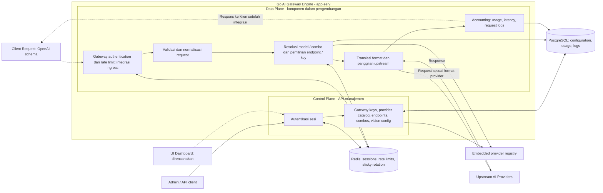

# pannelAI

<p>
  
  
  
  
  
  
  
</p>

API Gateway AI berbasis Go untuk mengelola akses klien, provider, upstream endpoint, dan pemilihan model melalui satu layanan backend.

Proyek memisahkan tanggung jawab **Control Plane** (API manajemen) dan **Data Plane** (pemrosesan permintaan AI) secara logis di dalam `app-serv`, bukan sebagai dua server terpisah.

> **Status: dalam pengembangan.** Komponen data plane sudah tersedia di kode, tetapi keberadaan modul belum berarti seluruh alur HTTP, streaming, dan accounting telah terintegrasi atau teruji end-to-end. Dashboard `app-ui` sudah punya scaffold fase U0 (login, gateway keys, settings security) dengan spesifikasi di [`docs/SPEC-UI/001-SPEC-UI.md`](docs/SPEC-UI/001-SPEC-UI.md) dan catatan teknis di [`app-ui/README.md`](app-ui/README.md); layar sisanya masih direncanakan dan ditandai Planned di sidebar.

`app-serv/` sekarang mencakup P0 (config, migrasi, health/version, auth sesi, CRUD gateway keys) dan bagian P1: **registry provider yang di-embed** (94 provider, dihasilkan dari referensi 9Router), **seam plugin per provider** (`internal/provider`, sehingga provider bisa di-patch atau ditambah tanpa menyentuh core), **agregat upstream endpoint dan multi-key** dengan circuit breaker per key, serta migrasi P1 untuk provider nodes, endpoints, combos, katalog model, usage, quota, logs, dan settings. Yang belum terpasang: repository/service endpoint dan route HTTP-nya, bulk onboarding (endpoint batch, key batch, import OAuth), combos, vision adapter, data plane chat, usage/quota read, logs, settings. Panel `app-ui` berada pada fase U0 (login, gateway keys, settings security), dengan spesifikasi di [`docs/SPEC-UI/001-SPEC-UI.md`](docs/SPEC-UI/001-SPEC-UI.md).

## Struktur proyek

```text
pannelAI/
├── app-serv                    # Go: control plane dan data plane dalam satu proses
│   ├── cmd/app-serv            # composition root: wiring per bidang, tanpa logika
│   ├── internal
│   │   ├── config              # konfigurasi env bertipe, divalidasi saat boot
│   │   ├── dataplane           # satu request chat end to end: resolve, seleksi, translasi
│   │   ├── domain              # entitas, value object, transisi state, envelope error
│   │   ├── handler             # decode, panggil service, encode
│   │   ├── netguard            # guard egress: validasi tujuan sebelum konek (SSRF)
│   │   ├── provider            # seam plugin konektivitas per provider
│   │   ├── registry            # registry provider yang di-embed
│   │   ├── repository          # kontrak penyimpanan dan implementasinya
│   │   │   ├── postgres        # implementasi PostgreSQL
│   │   │   └── redis           # implementasi Redis: sesi, counter, state sticky
│   │   ├── router              # tabel route dan middleware lintas-potong
│   │   ├── schema              # DTO, tag validasi, serialisasi respons
│   │   ├── service             # orkestrasi use case, panggilan keluar dengan timeout
│   │   └── tokensaver          # penerapan grup saver sesuai urutan referensi
│   ├── migrations              # 000001 … 000012, pasangan up/down
│   ├── tools                   # generator kode
│   │   ├── openapi-gen
│   │   ├── capability-gen.mjs
│   │   └── registry-gen.mjs
│   ├── .env.example
│   ├── .golangci.yml
│   ├── go.mod
│   ├── go.sum
│   └── README.md
├── app-ui                      # SvelteKit + Bun: panel yang memanggil API manajemen
│   ├── assets
│   │   └── static              # aset sumber dari pemilik (logo)
│   ├── scripts
│   │   └── boot-log.ts
│   ├── src
│   │   ├── lib
│   │   │   ├── api             # satu-satunya tempat fetch
│   │   │   ├── components      # shell, sidebar, dialog, tabel, form
│   │   │   ├── hooks           # hook lintas-komponen
│   │   │   ├── primitives      # komponen shadcn-svelte (generated)
│   │   │   ├── schemas         # skema Zod: primitif, sanitasi, kontrak respons
│   │   │   ├── server          # kode server-only: validasi env, forwarder /api/v1
│   │   │   ├── stores          # state sesi, tema, preferensi sidebar
│   │   │   ├── strings         # katalog teks per layar
│   │   │   ├── utils           # helper tampilan bersama
│   │   │   ├── dirty-guard.ts  # guard draft belum tersimpan
│   │   │   ├── icons.ts        # peta ikon
│   │   │   ├── motion.css      # token gerak untuk gambar Usage
│   │   │   ├── navigation.ts   # pohon sidebar sebagai data
│   │   │   ├── nav-path.ts
│   │   │   ├── polling.ts
│   │   │   ├── usage-live-reader.ts
│   │   │   ├── usage-live.ts   # pemilik koneksi Usage live
│   │   │   └── utils.ts
│   │   ├── routes              # satu direktori per layar (api-base … usage)
│   │   ├── app.css             # lapisan token: DESIGN.md §3 sampai §5
│   │   ├── app.d.ts
│   │   ├── app.html
│   │   └── hooks.server.ts
│   ├── static                  # aset yang disajikan
│   │   ├── fonts               # InterVariable.woff2 (self-hosted)
│   │   ├── favicon.png
│   │   ├── logo-mark@128.png
│   │   └── logo-mark.png
│   ├── tests                   # tes per area, plus support/ untuk helper bersama
│   ├── .env.example
│   ├── .prettierignore
│   ├── .prettierrc
│   ├── bun.lock
│   ├── components.json
│   ├── eslint.config.js
│   ├── package.json
│   ├── README.md
│   ├── svelte.config.js
│   ├── tsconfig.json
│   ├── vite.config.ts
│   └── vitest.config.ts
├── deployment
│   └── .gitkeep
├── docs
│   ├── CHANGELOG               # catatan rilis
│   ├── CONTRACT                # kontrak wire (YAML) dan turunannya
│   ├── DRAFT                   # catatan kesiapan per slice
│   ├── RULLES                  # TDD.md dan OWASP.md
│   ├── SPEC-API                # spesifikasi API dan token saver
│   └── SPEC-UI                 # spesifikasi panel
├── scrypts                     # quality gates dan git hooks
│   ├── gates                   # 8 gate: lint, tes, panel, secrets, contract
│   ├── hooks                   # pre-commit, pre-push, post-commit, graphify
│   ├── lib
│   └── README.md
├── skills                      # dokumen skill yang dilayani panel
│   ├── pannelai/SKILL.md
│   ├── pannelai-chat/SKILL.md
│   ├── pannelai-embeddings/SKILL.md
│   ├── pannelai-image/SKILL.md
│   ├── pannelai-stt/SKILL.md
│   ├── pannelai-tts/SKILL.md
│   └── pannelai-web-search/SKILL.md
├── .gitignore
├── .gitleaks.toml
├── AGENTS.md
├── DESIGN.md
├── LICENSE
├── README.md
└── SYSTEM_MAP.md
```

Panel `app-ui` hanya mengonsumsi API manajemen `app-serv` dan tidak mengakses PostgreSQL atau Redis secara langsung.

## Stack dan pembagian tanggung jawab

Fondasi backend menggunakan **Go**, HTTP standar **`net/http`**, **PostgreSQL** (`pgx/v5`), dan **Redis** (`go-redis/v9`). Validasi DTO backend menggunakan `go-playground/validator/v10`; validasi di sisi panel memakai **Zod**. Panel dibangun dengan **Svelte** dan toolchain **Bun**.

| Bagian | Tanggung jawab |
| --- | --- |
| Control Plane | Autentikasi sesi, pengelolaan gateway keys, katalog provider, upstream endpoints dan keys, combos, konfigurasi vision adapter |
| Data Plane | Komponen normalisasi request, resolusi model/combo, pemilihan endpoint/key, translasi format provider, HTTP upstream dengan retry/timeout |
| PostgreSQL | Data konfigurasi dan repository untuk usage, latency, serta request logs |
| Redis | Sesi, penghitung rate limit, dan state sticky round-robin |
| Dashboard | Panel Svelte (direncanakan) yang mengonsumsi API Control Plane |

## Arsitektur API Gateway

Diagram berikut menggambarkan **alur** berdasarkan komponen yang tersedia. 



## Contoh kasus data flow

**Skenario:** klien meminta model melalui sebuah combo dengan beberapa kandidat upstream.

1. Pada alur ingress yang dituju, gateway memeriksa akses, rate limit, dan payload klien.
2. Komponen data plane menormalisasi request ke bentuk chat internal, lalu meresolusikan combo, alias, atau referensi `provider/model`.
3. Kandidat diurutkan sesuai strategi combo. Endpoint dan key dipilih berdasarkan prioritas serta status yang dapat digunakan; sticky round-robin memakai Redis.
4. Request diterjemahkan ke format upstream. Implementasi renderer mencakup OpenAI, Claude, dan Gemini; hal ini bukan klaim seluruh fitur ketiganya sudah kompatibel.
5. Helper transport menyediakan retry untuk kegagalan jaringan, HTTP 429, dan 5xx. Pemindahan antar kandidat merupakan bagian dari integrasi alur fallback, berbeda dari retry ke target yang sama.
6. Repository menyediakan penulisan usage, latency, request logs, serta pembaruan penggunaan key. Integrasi pencatatan dan pengembalian respons perlu diuji sebagai satu alur lengkap.

Alur ini tidak menganggap dashboard analytics, streaming penuh, atau semua strategi combo.

## Dokumentasi lanjutan

- [Kontrak API](docs/SPEC-API/001-SPEC-API.md)
- [Aturan TDD](docs/RULLES/TDD.md)
- [Spesifikasi UI](docs/SPEC-UI/001-SPEC-UI.md)
- [Panel UI dan perintahnya](app-ui/README.md)
- [Backend dan konfigurasi](app-serv/README.md)
- [Contoh environment](app-serv/.env.example)
- [Peta sistem](SYSTEM_MAP.md)
- [Pedoman kontribusi](AGENTS.md)
- [Quality gates dan hooks](scrypts/README.md)

Dokumentasi ini menjelaskan struktur dan rancangan alur.

## Author

Dibangun oleh [rusmanadodi2598](https://github.com/rusmanadodi2598).
