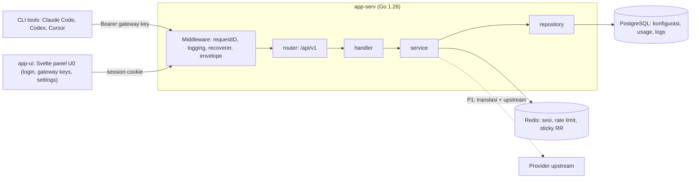
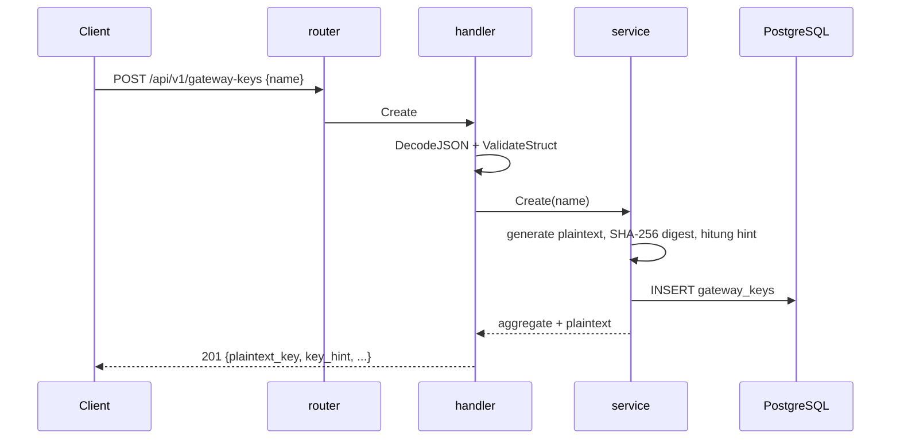
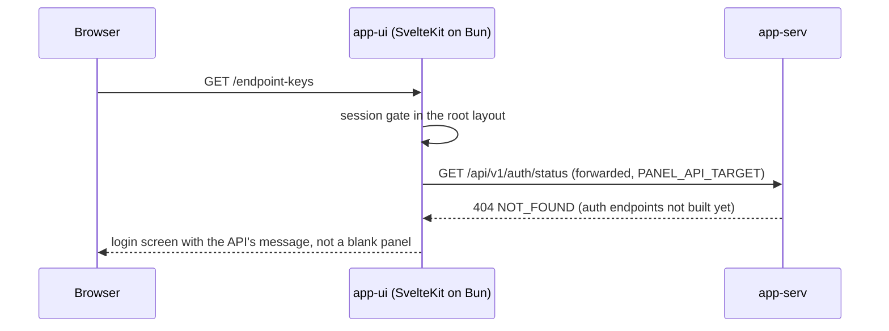
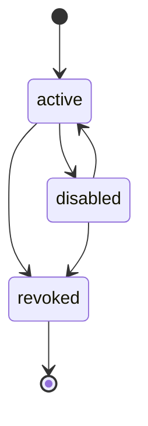

# SYSTEM_MAP.md

SSoT untuk topologi, batas domain, alur data, dan antrean asinkron **pannelAI**.
Diperbarui pada PR yang sama ketika topologi atau alur data berubah (AGENTS.md §1.9).

| | |
|---|---|
| **Status** | P0 sebagian: config, migrasi (dengan ledger), health/version, gateway keys selesai; auth §7.2 dan `scrypts/` gates belum |
| **Terakhir diperbarui** | 2026-09-16 |
| **Kontrak** | `docs/SPEC-API/001-SPEC-API.md` |

---

## 1. Topologi

Dua aplikasi, satu repositori. Keduanya berbagi PostgreSQL dan Redis secara logis; `app-ui` tidak pernah mengakses keduanya langsung.



**Batas domain saat ini (P0):** `gateway_keys`. Tabel lain di SPEC-API §6 belum dibuat; setiap tabel baru menambah satu domain dan satu repository pada layer yang sama.

---

## 2. Batas Layer

Alur satu arah, dipaksakan compiler lewat import antar-package (AGENTS.md §1.5):

```
schema → domain → repository → service → handler → router
```

| Layer | Paket | Tanggung jawab | Tidak boleh |
|---|---|---|---|
| schema | `internal/schema` | DTO, tag validasi, decoding, serialisasi respons | memanggil service atau repository |
| domain | `internal/domain` | Entitas, value object, transisi state, envelope error | mengimpor `net/http` |
| repository | `internal/repository`, `.../postgres` | Kontrak penyimpanan dan implementasinya | mengimpor service atau handler |
| service | `internal/service` | Orkestrasi use case, panggilan keluar dengan timeout | mengimpor `net/http` |
| handler | `internal/handler` | Decode, panggil service, encode | memuat SQL atau Redis langsung |
| router | `internal/router` | Tabel route dan middleware lintas-potong | memuat logika bisnis |

`cmd/app-serv/main.go` adalah composition root: hanya wiring, tanpa logika.

---

## 3. Alur Data

### 3.1 Permintaan manajemen (P0: gateway keys)



Plaintext hanya muncul pada respons create. Setiap pembacaan setelahnya hanya membawa `key_hint` (`sk-…abcd`), dan digest SHA-256 adalah satu-satunya bentuk yang tersimpan (SPEC-API-001 §4, §6).

### 3.2 Permintaan panel (app-ui U0)



The panel forwards `/api/v1` from its own server, so the browser talks to one
origin and no CORS rule is needed. Two consequences are worth recording:

- **The auth path is not wired end to end.** `app-serv` has no `/api/v1/auth/*`
  endpoints yet (SPEC-API-001 §7.2), so login cannot complete and the panel
  reports the API's own error rather than failing silently. That is the U0 exit
  criterion the panel spec leaves open.
- The panel never touches PostgreSQL or Redis; the API is its only surface
  (SPEC-API-001 §11.5, enforced by review because nothing else can see it).

### 3.3 Siklus hidup status



`revoked` bersifat terminal: transisi keluar ditolak dengan `CONFLICT`.

---

## 4. Endpoint Aktif (P0)

Setiap respons membawa `X-Request-Id` (dibuat bila tidak dikirim pemanggil) dan setiap request dicatat satu baris `slog` dengan id itu (SPEC-API-001 §4, §8).

| Method | Path | Auth | Sumber |
|---|---|---|---|
| GET | `/api/v1/health` | publik | liveness + PostgreSQL + Redis; `503` saat salah satu dependency tidak menjawab |
| GET | `/api/v1/version` | publik | build version, commit, registry revision |
| GET | `/api/v1/gateway-keys` | belum digerbangi | daftar (hint saja) + meta paginasi |
| POST | `/api/v1/gateway-keys` | belum digerbangi | buat; plaintext sekali |
| GET | `/api/v1/gateway-keys/{id}` | belum digerbangi | detail (hint saja) |
| PATCH | `/api/v1/gateway-keys/{id}` | belum digerbangi | ubah `name`, `status` |
| DELETE | `/api/v1/gateway-keys/{id}` | belum digerbangi | revoke (soft) |

Route metode-aware (Go 1.22 `ServeMux`), sehingga verbe yang salah dijawab mux dan dinormalkan ke envelope §8.

Route tidak dikenal dijawab `404 NOT_FOUND`, verbe salah dijawab `405 METHOD_NOT_ALLOWED`; keduanya lewat envelope §8 yang sama seperti error lain.

**Belum ada:** middleware sesi. Endpoint manajemen §7.2 belum dibangun, jadi seluruh route gateway keys masih terbuka, dan panel `app-ui` U0 memanggil `/api/v1/auth/*` yang belum ada sehingga login belum bisa selesai. Ini batas P0 yang disengaja, bukan celah yang terlupakan; P0 exit criteria menyebut login dan CRUD key diuji bersamaan.

## 4a. Migrasi

Berkas `app-serv/migrations/*.up.sql` di-embed ke binary dan diterapkan saat boot, dicatat di `schema_migrations`. Satu migrasi dijalankan paling banyak sekali per database, dalam satu transaksi bersama baris ledger-nya. Ini berlaku untuk P0 single-instance; produksi multi-replika harus memindahkannya ke job rilis terpisah.

---

## 5. Penyimpanan

| Sumber | Isi | Catatan |
|---|---|---|
| PostgreSQL | `gateway_keys` (P0), `schema_migrations` (ledger runner), tabel §6 lainnya (P1+) | pool limit eksplisit; setiap kolom lookup terindeks; `gateway_keys.name` UNIQUE |
| Redis | sesi, rate limit, sticky round-robin, circuit state | dibutuhkan untuk limiter dan state; bukan sekadar cache |

---

## 6. Asinkron

Belum ada worker pada P0. Antrean berikut masuk pada P1/P2 sesuai SPEC-API §3 dan §10:

| Worker | Pemicu | Kebijakan retry | Dead-letter |
|---|---|---|---|
| OAuth token refresh | `refresh_lead` tercapai | eksponensial + jitter (P2) | tandai endpoint `error` |
| Quota re-check | kadens per provider (5h/daily/weekly/monthly) | eksponensial (P1) | catat `resets_at` terakhir |
| Log flush / retensi | jadwal periodik | tetap (P1) | hapus melewati `retention_days` |

Setiap goroutine baru wajib memulihkan panic dan punya kondisi terminasi eksplisit (AGENTS.md §1.6).

---

## 7. Perubahan yang Memicu Pembaruan Berkas Ini

- tabel atau domain baru
- endpoint baru atau perpindahan batas auth
- penambahan worker atau antrean asinkron
- perubahan pembagian tanggung jawab antar-layer