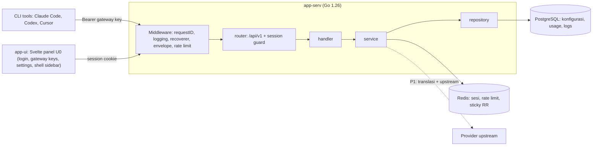
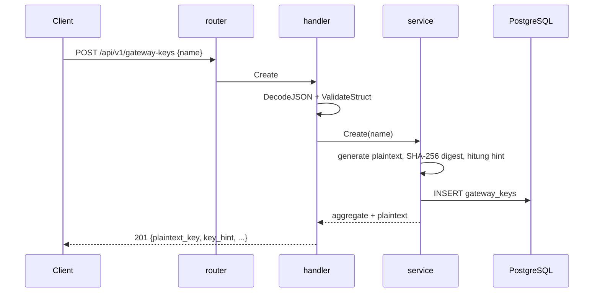
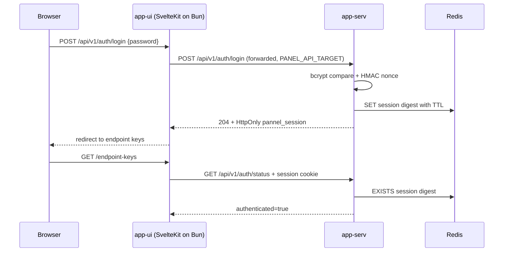
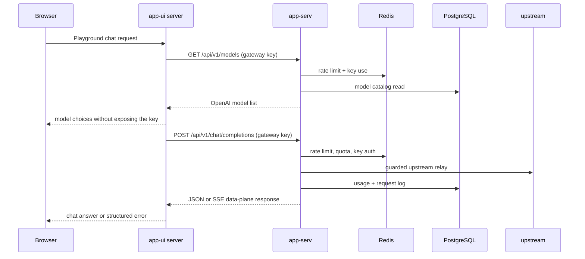
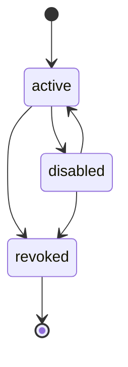

# SYSTEM_MAP.md

SSoT untuk topologi, batas domain, alur data, dan antrean asinkron **pannelAI**.
Diperbarui pada PR yang sama ketika topologi atau alur data berubah (AGENTS.md §1.9).

| | |
|---|---|
| **Status** | P0 selesai: config, migrasi, health/version, auth sesi, gateway keys, Redis lockout/rate limit, dan quality gates tercover. **P1 CLOSED**: registry provider di-embed (94 provider, decode ketat), seam plugin per provider, agregat `UpstreamEndpoint`/`UpstreamKey`/`ProviderNode` dengan circuit breaker per key, penyegel AES-256-GCM, dan migrasi P1 (000004-000008) terverifikasi terhadap PostgreSQL nyata. Seluruh endpoint manajemen P1 (§7.4-§7.8, §7.12-§7.14) plus data plane chat OpenAI+Anthropic dan embeddings terpasang dan teruji; multi-akun dan bulk onboarding (endpoint batch, key batch, OAuth import) lengkap dengan semantik all-or-nothing; adapter visi (§7.8) ikut menambah urutan model di jalur request lewat seam `dataplane.VisionAugmenter` dengan rotasi round-robin di Redis. Dua worker P1 berjalan: quota flush (Redis → PostgreSQL) dan log retention (purge per `retention_days`). Kriteria keluar P1 terpenuhi: `Engine.Relay` menuntaskan fallback combo end-to-end diuji di `internal/dataplane/engine_relay_test.go`, dan `go test -race ./...` bersih. Panel U0 selesai termasuk shell sidebar bertema; layar Usage dan Quota panel menyusul di atas P1 API. **P2 CLOSED**: seluruh permukaan §7.4–§7.15 terpasang dan terverifikasi live terhadap PostgreSQL 14 + Redis nyata dengan stub upstream dan stub proxy loopback — OAuth round-trip (start, callback, status, refresh per endpoint + due sweep), combo test, proxy pools (dua rute test + guard egress), token-saver, budget caps (cap terbaca kembali), katalog model + custom/alias/disabled, media §7.10 (speech, transcriptions, voices, images, search), embeddings lewat node kustom, dan jalur chat + media + embeddings yang menulis usage/log. Media plane memakai satu `MediaTransport` bersama embeddings di atas satu egress guard proses (`EGRESS_ALLOWED_TARGETS`), dan `settings.network.outbound_proxy_*` kini menentukan rute tiap panggilan keluar (§7.11). Sebelas format media non-OpenAI sudah punya adapter (Deepgram STT; NVIDIA NIM, Cartesia, ElevenLabs, MiniMax + MiniMax CN, Inworld, PlayHT, Coqui, Tortoise, Gemini TTS, Gemini STT). Register gap P2 (`docs/DRAFT/001-P2-GAPS.md`) menutup 20 dari 21 item; yang terbuka bukan kriteria keluar fase: lima format media sisa (G21 — AssemblyAI, AWS Polly, Edge TTS, Google TTS, Local Device, yang butuh lebih dari satu request per panggilan) dan pemeliharaan dokumen ini (G10, baris ini). `go test -race ./...` bersih (13 paket + `cmd`), tagged integration hijau, `go-lint.sh` dan `go-headers.sh` PASS |
| **Terakhir diperbarui** | 2026-09-21 |
| **Kontrak** | `docs/SPEC-API/001-SPEC-API.md` (semantik), `docs/CONTRACT/001-CONTRACT-API-V1.yaml` (wire contract), `app-serv/internal/handler/openapi.json` (generated served artifact) |

---

P2 readiness audit covered all §7.15 chat surfaces; the Playground Chat client path is now documented here as app-ui server-side forwarding over the gateway-key data plane. `POST /api/v1/chat/completions` authenticates before schema decode, typed semantic validation rejects malformed unions, and SSE status commits on the first frame. OpenAPI request schema parity is tested and generated from the YAML source. The F9 live evidence is closed: one non-streamed and one streamed call through the real router, gateway-key auth, Redis rate limit and quota counter, PostgreSQL usage/log rows, and a guarded loopback upstream, with the refusal paths (`401 UNAUTHORIZED`, `400 VALIDATION_ERROR`, `400 MODEL_NOT_FOUND`) recorded in `docs/DRAFT/009-PLAYGROUND-CHAT-ENDPOINT-READINESS.md` §10.9.


Dua aplikasi, satu repositori. Keduanya berbagi PostgreSQL dan Redis secara logis; `app-ui` tidak pernah mengakses keduanya langsung.



**Batas domain saat ini:** `gateway_keys` dan `panel_auth` (P0); `provider_nodes`, `upstream_endpoints`, `upstream_keys`, `combos`, `model_aliases`, `models_custom`, `models_disabled`, `usage_records`, `quota_windows`, `quota_caps`, `request_logs`, dan `settings` (P1, migrasi 000004-000008; repository, service, handler, dan data plane-nya terpasang); `proxies` (P2, 000009) dan `media_provider_settings` (P2, 000010) — keduanya dimiliki role aplikasi lewat `000011`, sama seperti seluruh schema. Provider registry bukan tabel: ia dokumen YAML yang di-embed ke binary (§5).

**Catatan migrasi P1:** kolom `quota_windows."window"` adalah reserved word PostgreSQL dan wajib dikutip; nama kolomnya dipertahankan agar sama dengan field API (SPEC-API §7.12 mengembalikan `window`). Idempotensi runner diuji, bukan diasumsikan: `migrations/apply_test.go` (tag `integration`) menjalankan runner sungguhan dua kali dan memastikan ledger tidak bertambah.

---

## 2. Batas Layer

Alur satu arah, dipaksakan compiler lewat import antar-package (AGENTS.md §1.5):

```
schema → domain → repository → service → handler → router
```

| Layer | Paket | Tanggung jawab | Tidak boleh |
|---|---|---|---|
| schema | `internal/schema` | DTO, tag validasi, decoding, serialisasi respons | memanggil service atau repository |
| domain | `internal/domain` | Entitas, value object, transisi state, envelope error | mengimpor `net/http` |
| repository | `internal/repository`, `.../postgres` | Kontrak penyimpanan dan implementasinya | mengimpor service atau handler |
| service | `internal/service` | Orkestrasi use case, panggilan keluar dengan timeout | mengimpor `net/http` |
| handler | `internal/handler` | Decode, panggil service, encode | memuat SQL atau Redis langsung |
| router | `internal/router` | Tabel route dan middleware lintas-potong | memuat logika bisnis |
| config | `internal/config`, `internal/registry`, `internal/provider` | Konfigurasi env bertipe, registry provider yang di-embed, dan seam plugin konektivitas per provider | memuat logika use case atau SQL |

`cmd/app-serv/main.go` adalah composition root: hanya wiring, tanpa logika.

### 2.1 Seam plugin provider (wajib, permintaan owner)

Setiap provider berbeda dalam konektivitas: ada yang **api_key**, ada yang **OAuth**, ada yang **gratis tanpa kredensial**, dan ada yang menerima **keduanya**. Perbedaan itu tidak boleh masuk ke core, karena satu patch provider lalu menjadi perubahan kode bersama.

`internal/provider` memisahkannya:

| Bagian | Isi |
|---|---|
| `Plugin` | Antarmuka satu provider: `Endpoint` (URL), `ApplyAuth` (header dan skema), `DecodeUsage`, `ShouldRetry`, `IsQuotaError` |
| `Base` | Perilaku bawaan yang di-embed tiap connector, sehingga provider baru cukup mengisi `ProviderID` |
| `Default` | Connector fallback: URL dari registry, header dan skema dari `transport.auth`, jadi vendor OpenAI/Claude-compatible tidak perlu berkas baru |
| `Connectors` | Lookup `provider id -> Plugin`, menolak id ganda, dan `Unsupported()` melaporkan provider yang butuh connector tapi belum ada |

**Konsekuensi operasional:** menambah provider = menambah entri di `registry.yaml` (speak format standar) atau satu berkas connector (protokol khusus). Tidak ada `switch` pada provider id di core, sehingga provider A bisa di-patch tanpa menyentuh provider B.

**Batasan yang diketahui:** `Connectors.Unsupported()` sengaja melaporkan provider ber-format khusus (mis. `kiro`, `cursor`, `antigravity`) selama connector-nya belum ditulis; laporan itu adalah daftar kerja, bukan kegagalan diam.

---

## 3. Alur Data

### 3.1 Permintaan manajemen (P0: gateway keys)



Plaintext hanya muncul pada respons create. Setiap pembacaan setelahnya hanya membawa `key_hint` (`sk-…abcd`), dan digest SHA-256 adalah satu-satunya bentuk yang tersimpan (SPEC-API-001 §4, §6).

### 3.2 Permintaan panel (app-ui U0)

Shell panel dirender dari data navigasi di `src/lib/navigation.ts`: lima grup yang masing-masing menjawab satu
pertanyaan operator (Configure, Observe, Optimize, Developer, System) berisi total 19 baris. Baris yang
layarnya belum dibangun tidak membawa `href`, sehingga tidak bisa dirender sebagai link; R-24 jadi sifat tipe,
bukan disiplin review. Tiga bentuk responsif: drawer di bawah 768px, rail ikon 64px pada 768-1023px, dan
sidebar 264px pada 1024px ke atas, dengan preferensi collapse disimpan di cookie.



The panel forwards `/api/v1` from its own server, so the browser talks to one
origin and no CORS rule is needed. The panel never touches PostgreSQL or Redis;
the API is its only surface (SPEC-API-001 §11.5).


### 3.2a Playground Chat (app-ui client over app-serv data plane)

Playground Chat is rendered and session-forwarded by `app-ui`; `app-serv` does not add a
`/playground` route. The app-ui server obtains or receives a gateway key through its server-side
boundary and calls the data plane with `Authorization: Bearer <gateway key>`:



The data-plane route is deliberately not session-gated: CLI callers and the app-ui server-side
forwarder use the gateway key. Authentication happens before body decoding, semantic validation
uses the typed `schema.ChatRequest` plus `go-playground/validator/v10`, and a stream commits its
200/SSE response only when its first frame is written; a pre-frame failure remains a normal
structured HTTP error. Every middleware wrapper forwards `Flush()` and `Unwrap()`
(`internal/router/middleware.go`, `internal/router/envelope.go`), and `newSSESink` flushes through
`http.ResponseController`, so a frame reaches the client while its handler is still open
(`internal/router/router_stream_flush_test.go`); before draft 010 F5 the chain hid
`http.Flusher` and the whole answer arrived as one blob. `/api/v1/models` lists the same routable
model identifiers the relay resolver accepts. PostgreSQL, Redis, upstream credentials, and
provider response bodies never cross into the browser boundary.


### 3.3 Autentikasi dan revocation

`POST /api/v1/auth/login` memverifikasi bcrypt hash dari `panel_auth`, membuat
nonce 32-byte, menandatanganinya dengan HMAC-SHA256 `SESSION_SECRET`, lalu
menyimpan digest nonce di Redis selama `SESSION_TTL`. Cookie `pannel_session`
bersifat HttpOnly, SameSite=Lax, Path `/`, dan Secure pada production.

`POST /api/v1/auth/logout` menghapus digest dari Redis. Guard sesi memverifikasi
signature dan keberadaan digest sebelum logout, change-password, atau route
`gateway-keys` dipanggil. Login failure counter dan lockout disimpan di Redis;
lima kegagalan berturut-turut memicu `LOGIN_LOCKOUT` (default 15 menit).

### 3.4 Siklus hidup status



`revoked` bersifat terminal: transisi keluar ditolak dengan `CONFLICT`.

### 3.5 Strategi combo di jalur request

`Engine.Relay` membaca strategi combo dari agregat yang sama dengan resolusi (satu pembacaan per request,
`dataplane.Resolution.ComboStrategy`), lalu:

- `fallback` — member dicoba berurutan; kegagalan yang `failoverWorthy` pindah ke member berikutnya, dan
  kegagalan request (validasi, provider tidak routable) berhenti tanpa menghabiskan akun lain.
- `fusion` — fan-out paralel ke seluruh member lewat goroutine (satu per member, masing-masing pulih dari
  panic), panggilan panel **non-streaming dan tanpa tools**, lalu `judge_model` menyintesis satu jawaban.
  Permintaan judge adalah permintaan klien ditambah satu turn direktif, sehingga `stream` dan tools klien
  tetap berlaku. Satu jawaban panel tidak di-fusion: klien non-streaming dilayani jawaban itu langsung,
  klien streaming di-issue ulang ke member yang hidup supaya menerima stream yang sah. Nol jawaban
  melaporkan kegagalan panel. `Outcome.LatencyMS` melaporkan durasi panel+judge, bukan panggilan judge saja.
- `round_robin` — urutan diputar dari counter Redis (`repository.ComboRotationStore`, key
  `pannelai:combo:rotation:<sha256(nama)>`). Aturan distribusi tetap satu tempat: `ComboService.Order`
  (yang juga mencatat kegagalan store ke log) dan engine hanya meminta urutan lewat seam
  `dataplane.ComboOrderer`, yang dipenuhi `*service.ComboService` langsung tanpa adapter. Engine jatuh ke
  urutan prioritas bila seam tidak ada, gagal, atau menjawab dengan panjang berbeda — rotasi adalah
  optimasi, bukan input kebenaran. Store di-reset `ComboService` saat daftar model atau strategi berubah.

Referensi member yang tidak lagi resolve dilewati, bukan menggagalkan combo: resolusi combo memulai dari
referensi pertama yang masih routable, dan panel melaporkan referensi rusak lewat slot yang hilang.

### 3.6 Jalur media (§7.10)

Enam rute data plane media (`/audio/speech`, `/audio/transcriptions`, `/audio/voices`, `/images/generations`,
`/videos/generations`, `/search`) memakai pipeline yang sama dengan chat, tetapi bukan `Engine.Relay`:

- model string berbentuk `provider/model` (split pada slash pertama, sehingga id ber-slash seperti
  `openai/gpt-4o-mini-tts` milik openrouter tetap utuh); provider yang tidak mendeklarasikan kind-nya,
  atau mendeklarasikan format yang belum punya adapter, ditolak dengan `PROVIDER_NOT_ROUTABLE` — bukan
  didial dengan payload yang salah bentuk.
- base URL efektif = override tersimpan (`media_provider_settings`, dibaca **per panggilan** lewat
  `service.MediaOverrideReader` supaya penyimpanan berlaku pada panggilan berikutnya, bukan boot berikutnya)
  dan jatuh ke registry bila tidak ada; tidak ada fallback cloud diam-diam.
- endpoint dipilih `MediaRouter` (selector engine yang sama, jadi circuit state bersama chat), lalu
  `service.MediaCallService.Prepare`/`Perform` memakai satu `dataplane.MediaTransport` bersama embeddings —
  satu pool koneksi, bukan satu per rute.
- jawaban dinormalkan per kind: speech bytes (atau base64 dengan `?response_format=json`), transkripsi
  diteruskan apa adanya, gambar ke `{created, data:[...]}`, search dari nama parameter yang dideklarasikan
  registry (`query_param`/`max_results_param`), voices dari `voices:` registry.
- adapter per format tinggal di `internal/service/media_*.go` dan menyentuh empat seam: gate format
  (`media_shape.go`), pembangun payload (`media_speech.go` plus satu file per provider), pembaca jawaban
  (`mediaAnswerReader`, dipanggil `Perform` sebelum amplop dibangun), dan label output
  (`SpeechOutputFormat`). Provider yang menaruh model atau voice di path memakai `dataplane.MediaPath`;
  kredensial non-bearer (`basic`, `playht`, header yang dideklarasikan registry) ditangani
  `media_credential.go`. Sebelas format sudah punya adapter; lima masih ditolak dengan nama karena satu
  panggilan butuh lebih dari satu request (G21: AssemblyAI, AWS Polly, Edge TTS, Google TTS, Local Device).

---

## 4. Endpoint Aktif (P0)

Setiap respons membawa `X-Request-Id` (dibuat bila tidak dikirim pemanggil) dan setiap request dicatat satu baris `slog` dengan id itu (SPEC-API-001 §4, §8).

| Method | Path | Auth | Sumber |
|---|---|---|---|
| GET | `/api/v1/health` | publik | liveness + PostgreSQL + Redis; `503` saat salah satu dependency tidak menjawab |
| GET | `/api/v1/version` | publik | build version, commit, registry revision |
| POST | `/api/v1/auth/login` | publik | bcrypt login; 204 + HttpOnly session cookie |
| GET | `/api/v1/auth/status` | publik | authenticated, require_login, password_configured |
| POST | `/api/v1/auth/logout` | S | revoke session; 204 + deletion cookie |
| POST | `/api/v1/auth/change-password` | S | verify current password; 204 |
| GET | `/api/v1/gateway-keys` | S | daftar (hint saja) + meta paginasi |
| POST | `/api/v1/gateway-keys` | S | buat; plaintext sekali |
| GET | `/api/v1/gateway-keys/{id}` | S | detail (hint saja) |
| PATCH | `/api/v1/gateway-keys/{id}` | S | ubah `name`, `status` |
| DELETE | `/api/v1/gateway-keys/{id}` | S | revoke (soft) |

Route metode-aware (Go 1.22 `ServeMux`), sehingga verbe yang salah dijawab mux dan dinormalkan ke envelope §8.

Route tidak dikenal dijawab `404 NOT_FOUND`, verbe salah dijawab `405 METHOD_NOT_ALLOWED`; keduanya lewat envelope §8 yang sama seperti error lain.

Semua endpoint manajemen selain health/version digerbangi sesi. `RATE_LIMIT_PER_MIN`
ditegakkan melalui Redis fixed-window middleware untuk traffic `/api/v1` selain
health/version (operational probes harus tetap dapat melaporkan Redis failure);
login memiliki counter dan lockout Redis terpisah.

Setiap perubahan endpoint, batas auth, schema request/response, status, atau error mapping wajib mengubah `docs/CONTRACT/001-CONTRACT-API-V1.yaml`, menjalankan `go run ./tools/openapi-gen` dari `app-serv`, dan memperbarui dokumentasi manual `docs/CONTRACT/001-CONTRACT-API-V1.md` pada PR yang sama. Gate `contract-openapi.sh` menolak artifact JSON yang stale.

## 4a. Migrasi

Berkas `app-serv/migrations/*.up.sql` di-embed ke binary dan diterapkan saat boot, dicatat di `schema_migrations`. Satu migrasi dijalankan paling banyak sekali per database, dalam satu transaksi bersama baris ledger-nya. Ini berlaku untuk P0 single-instance; produksi multi-replika harus memindahkannya ke job rilis terpisah.

Migrasi P1 (`000004`-`000008`) menambah `provider_nodes`, `upstream_endpoints` + `upstream_keys`, `combos` + `model_aliases` + `models_custom` + `models_disabled`, `usage_records` + `quota_windows` + `quota_caps`, `request_logs` + `settings`. Dua catatan yang lahir dari menjalankannya terhadap PostgreSQL nyata, bukan dari membaca kodenya:

- kolom `quota_windows."window"` **wajib dikutip**: `window` adalah reserved word di PostgreSQL, dan tanpa kutip migrasinya gagal parse. Nama kolomnya dipertahankan agar sama dengan field API (SPEC-API §7.12 mengembalikan `window`), bukan diganti demi parser lalu dipetakan balik di setiap query.
- idempotensi diuji, bukan diasumsikan: `migrations/apply_test.go` (tag `integration`) menjalankan runner sungguhan dua kali dan memastikan ledger tidak bertambah.

Migrasi P2 (`000009`-`000011`) menambah `proxies`, `media_provider_settings`, dan aturan kepemilikan tabel. Satu catatan yang lahir dari menjalankannya terhadap PostgreSQL nyata:

- migration berjalan sebagai role yang mem-boot gateway, jadi boot ber-DSN superuser membuat tabel milik superuser dan role aplikasi tidak bisa membacanya (terukur: `permission denied for table media_provider_settings` di `PATCH /media-providers/{id}` dan di setiap rute §7.11, sementara tabel lain normal). `000011` memindahkan kedua tabel itu ke role pemilik `gateway_keys` — satu aturan, bukan nama role per deployment — dan karena role yang tidak memiliki tabel tidak bisa memindahkannya, penolakan dilaporkan sebagai warning boot berisi statement yang harus dijalankan, bukan kegagalan boot. Invariannya dikunci `migrations/ownership_test.go` untuk seluruh schema.

---

## 5. Penyimpanan

| Sumber | Isi | Catatan |
|---|---|---|
| PostgreSQL | `gateway_keys` + singleton `panel_auth` (P0), `provider_nodes`, `upstream_endpoints`, `upstream_keys`, `combos`, `model_aliases`, `models_custom`, `models_disabled`, `usage_records`, `quota_windows`, `quota_caps`, `request_logs`, `settings`, `schema_migrations` (P1), `proxies` (P2, 000009), `media_provider_settings` (P2, 000010; PK `(provider_id, kind)`) | pool limit eksplisit; setiap kolom lookup terindeks; `gateway_keys.name` UNIQUE dan `value_hash` terindeks untuk autentikasi data plane; `upstream_keys.value_encrypted` dan token OAuth disegel AES-256-GCM (`internal/domain/secret.go`), `key_hint` satu-satunya bentuk yang dibaca kembali; `proxies.password_encrypted` disegel sama dan `has_password` satu-satunya bentuk yang dibaca kembali |
| Redis | `pannelai:auth:session:*`, login failure/lockout keys, gateway rate limit, sticky round-robin, circuit state, console ring buffer | dibutuhkan untuk limiter dan state; session digest langsung dapat dicabut |

---

## 6. Asinkron

Tiga worker berjalan bersama server, semuanya dipulai lewat `cmd/app-serv/worker_wiring.go` dengan batas panic dan terminasi lewat context (AGENTS.md §1.6). Antrean berikut masuk pada P2 sesuai SPEC-API §3 dan §10:

| Worker | Pemicu | Kebijakan retry | Dead-letter |
|---|---|---|---|
| Quota flush (`internal/service/quota_flush.go`) | tick 30 detik, batch terbatas; counter ditulis oleh tiap request yang dilayani (`internal/service/quota_counter.go`) | fixed tick, `MaxAttempts: 5` | baris Redis tersisa dicoba lagi pada tick berikutnya |
| Log retention (`internal/service/log_retention.go`) | tick 1 jam, cutoff dari `settings.logging.retention_days` | fixed tick, `MaxAttempts: 3` | DELETE bersifat set-based dan atomik; baris tetap untuk percobaan berikutnya |
| OAuth token refresh (`internal/service/oauth_refresh_worker.go`) | tick 5 menit, hanya endpoint `oauth` yang `refresh_state=due` | eksponensial dari 30 detik, jitter maksimum seperempat delay, plafon 30 menit, 5 percobaan | percobaan kelima menandai endpoint `error` lewat `MarkRefreshDeadLetter` dan berhenti di-retry |
| Quota re-check | **deferred ke P2** (§7.12, register G22): belum ada worker. Penegakan cap terjadi saat seleksi endpoint, dibaca dari `quota_caps` dan `MonthlyUsage`, jadi sebuah cap berlaku pada request berikutnya tanpa re-check terpisah | — | — |

Penegakan kuota ada di jalur seleksi, bukan di worker: `dataplane.Selector` menerima
`SelectorDeps.Gate` (§7.12, register G22) dan melewati endpoint yang spend bulan berjalannya
sudah mencapai cap tersimpan. Cap absen tidak pernah dianggap habis, dan pembacaan gate yang
gagal bersifat fail-open supaya gangguan control plane tidak mengunci seluruh data plane.
Ingest-nya ada di jalur accounting: `internal/service/quota_counter.go` menaikkan counter Redis
untuk setiap request yang dilayani, lewat seam yang dipakai bersama oleh chat
(`internal/service/chat_record.go`) dan media/embeddings (`internal/service/dataplane_record.go`).

Alur OAuth §7.4 (`internal/service/oauth_flow*.go`) memakai dua state eksternal: `state` single-use 10 menit di Redis (`pannelai:oauth:state:*`, `SET NX` + `GETDEL`) sebagai replay guard, dan token yang disegel AES-GCM pada `upstream_endpoints.oauth`. `POST .../oauth/start`, `GET .../oauth/status`, dan `POST .../oauth/refresh` adalah rute sesi; `GET .../oauth/callback` publik karena browser provider tidak bisa membawa cookie sesi. Tujuan redirect browser tidak pernah diambil dari request: `PUBLIC_BASE_URL` menang, origin `redirect_uri` hanya fallback absolut http(s), dan bila keduanya tidak ada callback menjawab JSON.

Setiap goroutine baru wajib memulihkan panic dan punya kondisi terminasi eksplisit (AGENTS.md §1.6).

---

## 7. Perubahan yang Memicu Pembaruan Berkas Ini

- tabel atau domain baru
- endpoint baru atau perpindahan batas auth
- penambahan worker atau antrean asinkron
- perubahan pembagian tanggung jawab antar-layer