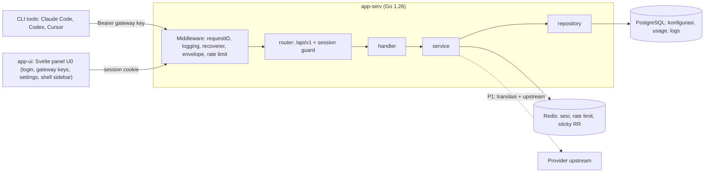
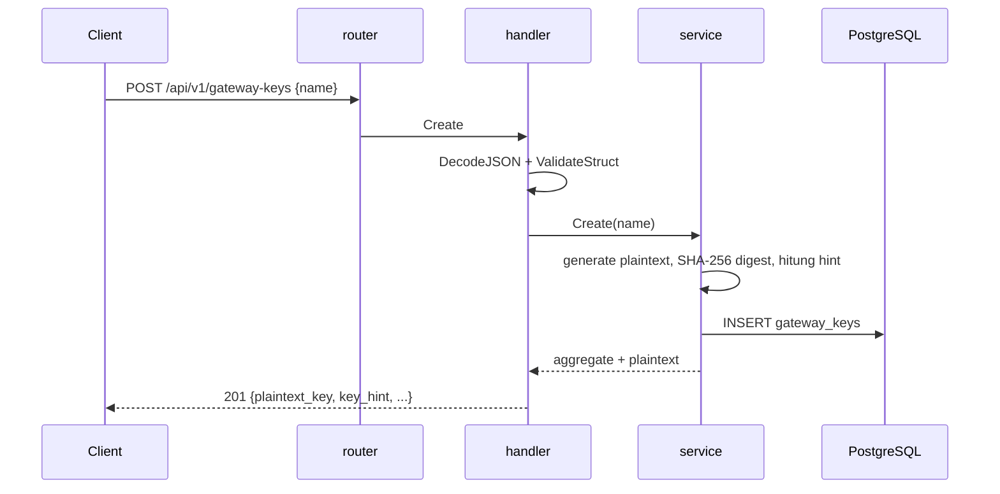
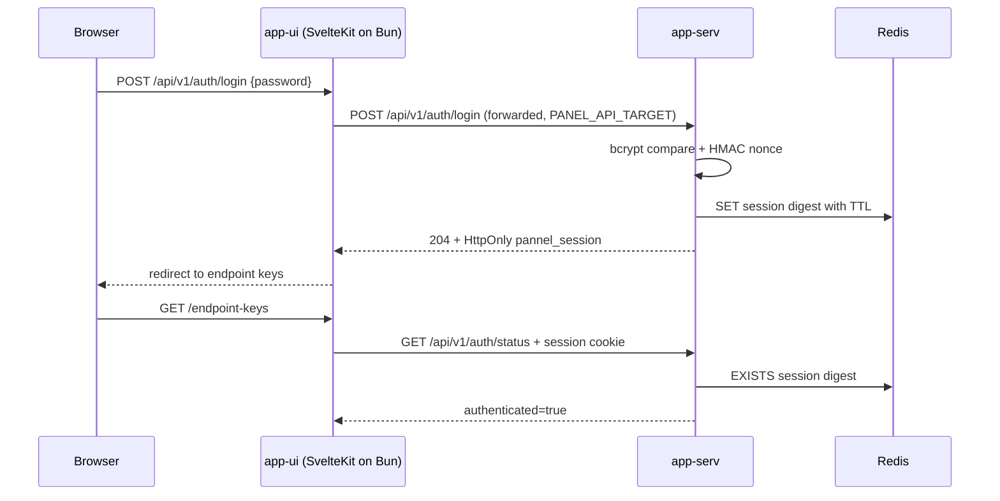
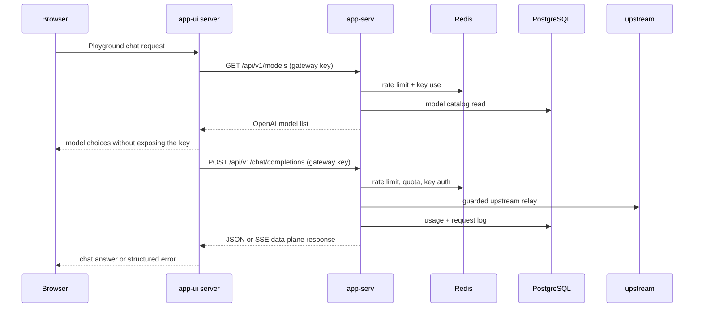
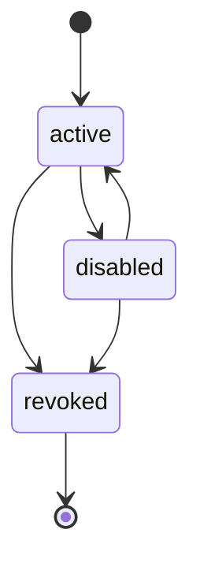

# SYSTEM_MAP.md

SSoT untuk topologi, batas domain, alur data, dan antrean asinkron **pannelAI**.
Diperbarui pada PR yang sama ketika topologi atau alur data berubah (AGENTS.md §1.9).

| | |
|---|---|
| **Status** | P0 selesai: config, migrasi, health/version, auth sesi, gateway keys, Redis lockout/rate limit, dan quality gates tercover. **P1 CLOSED**: registry provider di-embed (34 provider, decode ketat), seam plugin per provider, agregat `UpstreamEndpoint`/`UpstreamKey`/`ProviderNode` dengan circuit breaker per key, penyegel AES-256-GCM, dan migrasi P1 (000004-000008) terverifikasi terhadap PostgreSQL nyata. Seluruh endpoint manajemen P1 (§7.4-§7.8, §7.12-§7.14) plus data plane chat OpenAI+Anthropic dan embeddings terpasang dan teruji; multi-akun dan bulk onboarding (endpoint batch, key batch, OAuth import) lengkap dengan semantik all-or-nothing; adapter visi (§7.8) ikut menambah urutan model di jalur request lewat seam `dataplane.VisionAugmenter` dengan rotasi round-robin di Redis. Dua worker P1 berjalan: quota flush (Redis → PostgreSQL) dan log retention (purge per `retention_days`). Kriteria keluar P1 terpenuhi: `Engine.Relay` menuntaskan fallback combo end-to-end diuji di `internal/dataplane/engine_relay_test.go`, dan `go test -race ./...` bersih. Panel U0 selesai termasuk shell sidebar bertema; layar Usage dan Quota panel menyusul di atas P1 API. **P2 CLOSED**: seluruh permukaan §7.4-§7.15 terpasang dan terverifikasi live terhadap PostgreSQL 14 + Redis nyata dengan stub upstream dan stub proxy loopback: OAuth round-trip (start, callback, status, refresh per endpoint + due sweep), combo test, proxy pools (dua rute test + guard egress), token-saver, budget caps (cap terbaca kembali), katalog model + custom/alias/disabled, media §7.10 (speech, transcriptions, voices, images, search), embeddings lewat node kustom, dan jalur chat + media + embeddings yang menulis usage/log. Media plane memakai satu `MediaTransport` bersama embeddings di atas satu egress guard proses (`EGRESS_ALLOWED_TARGETS`), dan `settings.network.outbound_proxy_*` kini menentukan rute tiap panggilan keluar (§7.11). Sebelas format media non-OpenAI sudah punya adapter (Deepgram STT; NVIDIA NIM, Cartesia, ElevenLabs, MiniMax + MiniMax CN, Inworld, PlayHT, Coqui, Tortoise, Gemini TTS, Gemini STT). Register gap P2 (`docs/DRAFT/001-P2-GAPS.md`) menutup 20 dari 21 item; yang terbuka bukan kriteria keluar fase: lima format media sisa (G21: AssemblyAI, AWS Polly, Edge TTS, Google TTS, Local Device, yang butuh lebih dari satu request per panggilan) dan pemeliharaan dokumen ini (G10, baris ini). `go test -race ./...` bersih (13 paket + `cmd`), tagged integration hijau, `go-lint.sh` dan `go-headers.sh` PASS |
| **Terakhir diperbarui** | 2026-10-03 (draft 043: nama Combo ikut menyeberangi stream Usage live, dan panel menggambar jalur request penuh) |
| **Kontrak** | `docs/SPEC-API/001-SPEC-API.md` (semantik), `docs/CONTRACT/001-CONTRACT-API-V1.yaml` (wire contract), `app-serv/internal/handler/openapi.json` (generated served artifact) |

---

P2 readiness audit covered all §7.15 chat surfaces; the Playground Chat client path is now documented here as app-ui server-side forwarding over the gateway-key data plane. `POST /api/v1/chat/completions` authenticates before schema decode, typed semantic validation rejects malformed unions, and SSE status commits on the first frame. OpenAPI request schema parity is tested and generated from the YAML source. The F9 live evidence is closed: one non-streamed and one streamed call through the real router, gateway-key auth, Redis rate limit and quota counter, PostgreSQL usage/log rows, and a guarded loopback upstream, with the refusal paths (`401 UNAUTHORIZED`, `400 VALIDATION_ERROR`, `400 MODEL_NOT_FOUND`) recorded in `docs/DRAFT/009-PLAYGROUND-CHAT-ENDPOINT-READINESS.md` §10.9.


Dua aplikasi, satu repositori. Keduanya berbagi PostgreSQL dan Redis secara logis; `app-ui` tidak pernah mengakses keduanya langsung.


```mermaid
flowchart LR
    CLI["CLI tools: Claude Code, Codex, Cursor"]
    UI["app-ui: Svelte panel U0 (login, gateway keys, settings, shell sidebar)"]

    subgraph serv["app-serv (Go 1.26)"]
        direction TB
        MW["Middleware: requestID, logging, recoverer, envelope, rate limit"]
        RT["router: /api/v1 + session guard"]
        H["handler"]
        S["service"]
        R["repository"]
        MW --> RT --> H --> S --> R
    end

    PG[("PostgreSQL: konfigurasi, usage, logs")]
    RD[("Redis: sesi, rate limit, sticky RR")]
    UP["Provider upstream"]

    CLI -->|"Bearer gateway key"| MW
    UI -->|"session cookie"| MW
    R --> PG
    S --> RD
    S -.->|"P1: translasi + upstream"| UP
```

**Batas domain saat ini:** `gateway_keys` dan `panel_auth` (P0); `provider_nodes`, `upstream_endpoints` (kolom parity koneksi lewat 000012), `upstream_keys`, `combos`, `model_aliases`, `models_custom`, `models_disabled`, `usage_records`, `quota_windows`, `quota_caps`, `request_logs`, dan `settings` (P1, migrasi 000004-000008; repository, service, handler, dan data plane-nya terpasang); `proxies` (P2, 000009) dan `media_provider_settings` (P2, 000010), keduanya dimiliki role aplikasi lewat `000011`, sama seperti seluruh schema; `quota_published_state` + `quota_published_window` (migrasi 000013, cache jawaban provider yang ditulis worker dan dibaca layar); `000014` dan `000015` tidak menambah tabel atau kolom, hanya index untuk lookup jalur request (§1.7); `000015` mengganti ekspresi index email OAuth ke `lower(...)` karena query dedup memfilter bentuk itu, bukan ekspresi telanjangnya. Provider registry bukan tabel: ia dokumen YAML yang di-embed ke binary (§5).

**Catatan migrasi P1:** kolom `quota_windows."window"` adalah reserved word PostgreSQL dan wajib dikutip; nama kolomnya dipertahankan agar sama dengan field API (SPEC-API §7.12 mengembalikan `window`). Idempotensi runner diuji, bukan diasumsikan: `migrations/apply_test.go` (tag `integration`) menjalankan runner sungguhan dua kali dan memastikan ledger tidak bertambah.

---

## 2. Batas Layer

Alur satu arah, dipaksakan compiler lewat import antar-package (AGENTS.md §1.5):

```
schema → domain → repository → service → handler → router
```

| Layer | Paket | Tanggung jawab | Tidak boleh |
|---|---|---|---|
| schema | `internal/schema` | DTO, tag validasi, decoding, serialisasi respons | memanggil service atau repository |
| domain | `internal/domain` | Entitas, value object, transisi state, envelope error | mengimpor `net/http` |
| repository | `internal/repository`, `.../postgres` | Kontrak penyimpanan dan implementasinya | mengimpor service atau handler |
| service | `internal/service` | Orkestrasi use case; nol import `net/http` di paket ini sendiri, egress tinggal di subpackagenya | memuat tipe inbound `*http.Request`/`http.ResponseWriter`, dan kini juga tidak lagi memuat klien HTTP outgoing |
| service (egress) | `internal/service/oauthhttp`, `internal/service/quotafetch` | Ronde OAuth (grant, device flow, state round, identity decode) dan pembacaan kuota terbitan provider: keduanya pembicaraan HTTP keluar dengan timeout sendiri | mengimpor `internal/service` (arah dependensinya service → subpackage) |
| handler | `internal/handler` | Decode, panggil service, encode | memuat SQL atau Redis langsung |
| router | `internal/router` | Tabel route dan middleware lintas-potong | memuat logika bisnis |
| config | `internal/config` | Konfigurasi env bertipe, validasi fail-fast saat boot | memuat logika use case atau SQL |
| domain + schema | `internal/registry` | Dokumen registry provider yang di-embed: bentuk dokumen (schema), tabel kapabilitas, harga $/1M-token untuk estimasi cost chat (di-generate dari reference via `tools/pricing-gen.mjs` dan dipin corpus jawaban reference sendiri), dan aturan resolusi kapabilitas (domain) | mengimpor service, handler, atau repository |
| service | `internal/provider` | Seam plugin konektivitas per provider: bangun request, tanda tangani, terjemahkan jawaban upstream | memuat tipe inbound `*http.Request`/`http.ResponseWriter`, atau logika use case |

`cmd/app-serv/main.go` adalah composition root: hanya wiring, tanpa logika. Ia memanggil
`router.Deps.AssertWired()` sebelum `router.New`, sehingga deployment yang kehilangan satu
handler saja gagal saat boot dan menyebut nama field yang kurang, bukan menjawab 500 pada
rutenya saat pertama diklik (audit anti-slop 003 F36).

### 2.1 Seam plugin provider (wajib, permintaan owner)

Setiap provider berbeda dalam konektivitas: ada yang **api_key**, ada yang **OAuth**, ada yang **gratis tanpa kredensial**, dan ada yang menerima **keduanya**. Perbedaan itu tidak boleh masuk ke core, karena satu patch provider lalu menjadi perubahan kode bersama.

`internal/provider` memisahkannya:

| Bagian | Isi |
|---|---|
| `Plugin` | Antarmuka satu provider: `Endpoint` (URL), `ApplyAuth` (header dan skema), `DecodeUsage`, `ShouldRetry`, `IsQuotaError` |
| `Base` | Perilaku bawaan yang di-embed tiap connector, sehingga provider baru cukup mengisi `ProviderID` |
| `Request.Context` | Konteks pemanggil yang ikut berjalan di atas request, karena seam `Transformer` hanya menerima request tanpa parameter: transport data plane mengisinya, dan connector yang membaca sesuatu saat shaping (katalog model Qoder) memakai konteks itu untuk berhenti ketika klien pergi. Read-nya sendiri tetap pada context terikat sendiri karena satu fetch menjawab semua lookup konkuren, sehingga membatalkannya saat leader berangkat justru merusak yang masih menunggu (audit anti-slop 003 F15) |
| `Default` | Connector fallback: URL dari registry, header dan skema dari `transport.auth`, jadi vendor OpenAI/Claude-compatible tidak perlu berkas baru |
| `Connectors` | Lookup `provider id -> Plugin`, menolak id ganda, dan `Unsupported()` melaporkan provider yang butuh connector tapi belum ada |

**Konsekuensi operasional:** menambah provider = menambah entri di `registry.yaml` (speak format standar) atau satu berkas connector (protokol khusus). Tidak ada `switch` pada provider id di core, sehingga provider A bisa di-patch tanpa menyentuh provider B.

**Batasan yang diketahui:** `Connectors.Unsupported()` sengaja melaporkan provider ber-format khusus (mis. `kiro`, `cursor`, `antigravity`) selama connector-nya belum ditulis; laporan itu adalah daftar kerja, bukan kegagalan diam.

**Forced stream diputuskan oleh deklarasi connector, bukan oleh field registry.** Seam-nya `provider.StreamForcer` (`ForcesStream() bool`), dan `transport.force_stream` pada entri hanyalah data yang belum dibaca siapa-siapa di jalur request. Yang saat ini mendeklarasikannya: OpenCode (`internal/provider/opencode.go`) dan CodeBuddy CN + Intl (`internal/provider/codebuddy.go`; connector itu ada karena dua hal, stream paksa dan bentuk body; sisanya wire OpenAI biasa yang sudah dilayani `Default`). Empat entri lain mendeklarasikan `force_stream: true` di registry tanpa connector yang memutuskannya (`openai`, `commandcode`, `grok-cli`, `zed`), tercatat sebagai F5 di `docs/DRAFT/011-CODEBUDDY-PROVIDER-READINESS.md` §10.7.

**Bentuk body adalah seam terpisah: `provider.Transformer` (`TransformRequest(req *Request) error`).** Ini jalan bagi vendor yang tidak menerima list pesan OpenAI apa adanya; core tidak pernah bercabang pada provider id, dan `applyShape` (`internal/dataplane/transport_shape.go`) memanggilnya sebelum URL dibangun. Yang mengimplementasikannya hari ini: OpenCode (`opencode_body.go`), Qoder (`qoder_body.go`), dan CodeBuddy (`codebuddy_body.go`: satu turn `system` leading yang membawa prompt vendor **plus** instruksi system milik caller, konten `user` string diangkat jadi typed blocks, `reasoning_effort` none/off dihapus dan yang lain dicerminkan sebagai `reasoning_summary: "auto"`) karena vendor itu menjawab body polos dengan `11101 invalid request`.

**Qoder (`qoder`, `qoder-cn`) punya connector khusus dan sudah dilayani end-to-end.** Provider ini tidak membaca bearer token: setiap request ditanda tangani (COSY: payload user info terenkripsi + MD5 atas lima bagian, lihat `internal/provider/qoder_cosy.go`), host inference dipilih dari jenis kredensial (`dt-` di `api3`, `jt-`/`pt-` di `api2` untuk intl; CN satu gateway), dan sebuah Personal Access Token lebih dulu ditukar menjadi job token lewat `POST /api/v1/jobToken/exchange` dengan cache berdasar expiry yang vendor nyatakan dalam **milidetik** (draft 036 §5). Body chat bukan hasil translasi OpenAI: `TransformRequest` membangun payload agent (`qoder_body.go`) dengan `model_config` yang dibaca dari katalog hidup milik akun (`qoder_catalog.go`, di-cache satu jam), dan jawaban vendor tiba sebagai **envelope SSE** (`{statusCodeValue, body}` per frame) sehingga dibongkar sebelum di-pipe. Penolakan di frame pertama jadi kegagalan upstream, bukan jawaban yang ditagih (`qoder_envelope.go`, seam opsional `provider.StreamEnvelope`). Kuota dibaca lewat `internal/service/quotafetch/qoder.go` (dua bucket kredit, PAT ditukar lebih dulu) dan sejak 2026-09-28 punya pemanggil produksi: `GET /api/v1/quotas/{endpoint_id}/usage` (§7.12, aturannya di §3.7). Satu completion sukses kini terbukti lewat model yang vendor tagih nol (`qfmodel`), karena akun pengukur tetap kehabisan kuota untuk model berbayar (`code 112`) dan penolakan itu datang sebagai kegagalan kuota, bukan jawaban (draft 036 §5.4).

---

## 3. Alur Data

### 3.1 Permintaan manajemen (P0: gateway keys)


```mermaid
sequenceDiagram
    participant C as Client
    participant R as router
    participant H as handler
    participant S as service
    participant P as PostgreSQL

    C->>R: POST /api/v1/gateway-keys {name}
    R->>H: Create
    H->>H: DecodeJSON + ValidateStruct
    H->>S: Create(name)
    S->>S: generate plaintext, SHA-256 digest, hitung hint
    S->>P: INSERT gateway_keys
    S-->>H: aggregate + plaintext
    H-->>C: 201 {plaintext_key, key_hint, ...}
```

Plaintext hanya muncul pada respons create. Setiap pembacaan setelahnya hanya membawa `key_hint` (`sk-…abcd`), dan digest SHA-256 adalah satu-satunya bentuk yang tersimpan (SPEC-API-001 §4, §6).

### 3.2 Permintaan panel (app-ui U0)

Shell panel dirender dari data navigasi di `src/lib/navigation.ts`: lima grup yang masing-masing menjawab satu
pertanyaan operator (Configure, Observe, Optimize, Developer, System) berisi total 19 baris. Baris yang
layarnya belum dibangun tidak membawa `href`, sehingga tidak bisa dirender sebagai link; R-24 jadi sifat tipe,
bukan disiplin review. Tiga bentuk responsif: drawer di bawah 768px, rail ikon 64px pada 768-1023px, dan
sidebar 264px pada 1024px ke atas, dengan preferensi collapse disimpan di cookie.


```mermaid
sequenceDiagram
    participant B as Browser
    participant U as app-ui (SvelteKit on Bun)
    participant S as app-serv
    participant R as Redis

    B->>U: POST /api/v1/auth/login {password}
    U->>S: POST /api/v1/auth/login (forwarded, PANEL_API_TARGET)
    S->>S: bcrypt compare + HMAC nonce
    S->>R: SET session digest with TTL
    S-->>U: 204 + HttpOnly pannel_session
    U-->>B: redirect to endpoint keys
    B->>U: GET /endpoint-keys
    U->>S: GET /api/v1/auth/status + session cookie
    S->>R: EXISTS session digest
    S-->>U: authenticated=true
```

The panel forwards `/api/v1` from its own server, so the browser talks to one
origin and no CORS rule is needed. The panel never touches PostgreSQL or Redis;
the API is its only surface (SPEC-API-001 §11.5).


### 3.2a Playground Chat (app-ui client over app-serv data plane)

Playground Chat is rendered and session-forwarded by `app-ui`; `app-serv` does not add a
`/playground` route. The app-ui server obtains or receives a gateway key through its server-side
boundary and calls the data plane with `Authorization: Bearer <gateway key>`:


```mermaid
sequenceDiagram
    participant B as Browser
    participant U as app-ui server
    participant S as app-serv
    participant R as Redis
    participant P as PostgreSQL
    participant X as upstream

    B->>U: Playground chat request
    U->>S: GET /api/v1/models (gateway key)
    S->>R: rate limit + key use
    S->>P: model catalog read
    S-->>U: OpenAI model list
    U-->>B: model choices without exposing the key
    U->>S: POST /api/v1/chat/completions (gateway key)
    S->>R: rate limit, quota, key auth
    S->>X: guarded upstream relay
    S->>P: usage + request log
    S-->>U: JSON or SSE data-plane response
    U-->>B: chat answer or structured error
```

The data-plane route is deliberately not session-gated: CLI callers and the app-ui server-side
forwarder use the gateway key. Authentication happens before body decoding, semantic validation
uses the typed `schema.ChatRequest` plus `go-playground/validator/v10`, and a stream commits its
200/SSE response only when its first frame is written; a pre-frame failure remains a normal
structured HTTP error. Every middleware wrapper forwards `Flush()` and `Unwrap()`
(`internal/router/middleware.go`, `internal/router/envelope.go`), and `newSSESink` flushes through
`http.ResponseController`, so a frame reaches the client while its handler is still open
(`internal/router/router_stream_flush_test.go`); before draft 010 F5 the chain hid
`http.Flusher` and the whole answer arrived as one blob. `/api/v1/models` lists what the relay can
actually place: a provider holding an endpoint the selector would pick, or one that needs no
credential, plus the models the operator added in `models_custom`, each spelled the way a client
sends it (a custom node by its prefix, not by the id the gateway minted). The read therefore draws on
`upstream_endpoints` and `models_custom` beside the registry; before draft 040 F1 and F2 it enumerated
the registry alone, which named 205 identifiers the resolver answered `NO_PROVIDER_AVAILABLE` for while
hiding every row the operator had added. PostgreSQL, Redis, upstream credentials, and
provider response bodies never cross into the browser boundary.


### 3.3 Autentikasi dan revocation

`POST /api/v1/auth/login` memverifikasi bcrypt hash dari `panel_auth`, membuat
nonce 32-byte, menandatanganinya dengan HMAC-SHA256 `SESSION_SECRET`, lalu
menyimpan digest nonce di Redis selama `SESSION_TTL`. Cookie `pannel_session`
bersifat HttpOnly, SameSite=Lax, Path `/`, dan Secure pada production.

`POST /api/v1/auth/logout` menghapus digest dari Redis. Guard sesi memverifikasi
signature dan keberadaan digest sebelum logout, change-password, atau route
`gateway-keys` dipanggil. Login failure counter dan lockout disimpan di Redis;
lima kegagalan berturut-turut memicu `LOGIN_LOCKOUT` (default 15 menit).

### 3.4 Siklus hidup status


```mermaid
stateDiagram-v2
    [*] --> active
    active --> disabled
    disabled --> active
    active --> revoked
    disabled --> revoked
    revoked --> [*]
```

`revoked` bersifat terminal: transisi keluar ditolak dengan `CONFLICT`.

### 3.5 Strategi combo di jalur request

`Engine.Relay` membaca strategi combo dari agregat yang sama dengan resolusi (satu pembacaan per request,
`dataplane.Resolution.ComboStrategy`), lalu:

- `fallback`: member dicoba berurutan; kegagalan yang `failoverWorthy` pindah ke member berikutnya, dan
  kegagalan request (validasi, provider tidak routable) berhenti tanpa menghabiskan akun lain. Dua batas
  berlaku di atas aturan itu. Pertama, resolusi tiap member menolak pasangan yang ada di `models_disabled`
  (§7.6) sebelum akun mana pun dihabiskan, sama seperti daftar model menyembunyikannya; sebelumnya hanya
  sisi daftar yang menghormati sakelar itu, sehingga menyebut model yang di-disable tetap di-route dan
  tetap ditagih (`internal/dataplane/resolve_disabled.go`).
  Kedua, kegagalan di tengah stream tidak lagi berpindah member begitu frame pertama sampai ke klien:
  `Outcome.FramesWritten` membuat jalannya berhenti, karena melanjutkan berarti menempel jawaban kedua di
  stream yang sedang dibaca klien dan membayar dua upstream untuk satu request.
- `fusion`: fan-out paralel ke seluruh member lewat goroutine (satu per member, masing-masing pulih dari
  panic), panggilan panel **non-streaming dan tanpa tools**, lalu `judge_model` menyintesis satu jawaban.
  Permintaan judge adalah permintaan klien ditambah satu turn direktif, sehingga `stream` dan tools klien
  tetap berlaku. Satu jawaban panel tidak di-fusion: klien non-streaming dilayani jawaban itu langsung,
  klien streaming di-issue ulang ke member yang hidup supaya menerima stream yang sah. Nol jawaban
  melaporkan kegagalan panel. `Outcome.LatencyMS` melaporkan durasi panel+judge, bukan panggilan judge saja.
- `round_robin`: urutan diputar dari counter Redis (`repository.ComboRotationStore`, key
  `pannelai:combo:rotation:<sha256(nama)>`). Aturan distribusi tetap satu tempat: `ComboService.Order`
  (yang juga mencatat kegagalan store ke log) dan engine hanya meminta urutan lewat seam
  `dataplane.ComboOrderer`, yang dipenuhi `*service.ComboService` langsung tanpa adapter. Engine jatuh ke
  urutan prioritas bila seam tidak ada, gagal, atau menjawab dengan panjang berbeda: rotasi adalah
  optimasi, bukan input kebenaran. Store di-reset `ComboService` saat daftar model atau strategi berubah.

Referensi member yang tidak lagi resolve dilewati, bukan menggagalkan combo: resolusi combo memulai dari
referensi pertama yang masih routable, dan panel melaporkan referensi rusak lewat slot yang hilang.

Satu kasus lagi pindah member, dan ia **bukan** kegagalan: model reasoning yang menghabiskan seluruh
`max_output_tokens` untuk thinking menjawab **200** dengan pesan kosong dan `finish_reason: length`. Walk
membacanya lewat flag `Outcome.Truncated` (bukan error) dan mencoba member berikutnya sebelum body itu
dihidangkan; menandainya sebagai error akan mem-park kredensial yang justru menjawab sesuai permintaan, dan
`failureClass` tidak bisa membedakan keduanya. Aturan turunan yang menahan flag dari menyalah: apa pun yang
bisa ditampilkan client dihitung jawaban (teks, tool call, atau reasoning, karena fold memang mempertahankan
reasoning saat content kosong); hanya berhenti karena ceiling yang memicu, bukan `stop`; client streaming
tidak di-walk ulang karena frame-nya sudah sampai; dan bila semua member sama kosongnya, body kosong terakhir
yang dihidangkan, mengalahkan error member mana pun, supaya `finish_reason: length` tetap menjadi sinyal
pemakai bahwa ceiling-nya terlalu kecil. Rotasi tetap maju satu langkah per request, bukan per percobaan,
karena urutan dibaca sekali sebelum walk.

**Nama yang dijawab combo ke klien.** `Resolution.ClientModel()` melaporkan nama yang klien kirim (nama
combo bila combo yang menjawab), dan setiap tempat yang *menamai* jawaban (`openAIAnswer`, `claudeAnswer`,
`responsesClientAnswer`, `foldChatEvents`, ketiga `New*StreamState`, dan `stampAnswerModel` di jalur
passthrough satu-wire) membacanya. `Resolution.ModelID`/`UpstreamID` tetap milik routing, rotasi, dan
reasoning, dan `Outcome.Model`/`Outcome.Combo` tetap baris pemakaian atas nama member yang benar-benar
dipanggil: penamaan jawaban dan penagihan adalah dua pertanyaan berbeda, dan memindahkan yang pertama
tidak boleh menyeret yang kedua. Jalur passthrough adalah pengecualian yang perlu dicatat karena ia
mengirim body apa adanya: tidak ada terjemahan tempat nama bisa dipilih, jadi nomornya ditulis ulang,
bukan body-nya disalin ulang.

**Adapter visi di walk yang sama (§7.8).** Seam `dataplane.VisionAugmenter` kini menerima **seluruh**
kandidat request, bukan member terdepan saja, dan menjawab urutan plus daftar mana yang berasal dari
adapter. Adapter disisipkan setelah kandidat yang bisa membaca gambar dan sebelum yang tidak; ia tetap
pertama bila tidak ada yang bisa, dan tidak dikonsultasikan sama sekali (juga tidak menghabiskan langkah
rotasi Redis) bila tidak ada yang buta. Keputusan kapabilitas tidak lagi berasal dari pola nama model-id:
ia dibaca dari **katalog** lewat `ModelCatalogService.VisionCapable` (jalur baca baru dari data plane ke
`models_custom`/katalog di atas satu `referenceView` yang sama dengan `ModelExists`), jadi satu pembacaan
per request dan tanpa tabel kedua. Konsekuensi alirannya perlu disebut eksplisit karena ini pembacaan
baru di jalur request: permintaan bergambar kini melakukan satu pembacaan katalog per kandidat, bukan nol.
Jawaban jalur ini **additive** dan sengaja berbeda satu arah dari predicate filter panel
(`modelHasCapability`): baris katalog boleh menyalakan kapabilitas, tapi baris yang tidak menyebut vision
tidak dibaca sebagai penolakan, karena seluruh model custom node adalah baris semacam itu, dan membaca
diam sebagai tolak membuat `deepseek-v4.1-flash` (yang reference sendiri nyatakan capable) mengirim
gambarnya ke adapter. Di layar panel sebuah deklarasi adalah pernyataan operator; di jalur request jawaban
salah mengirim konten gambar nyata ke model yang salah.
Model yang tidak punya baris katalog jatuh ke predicate yang di-inject dari komposisi (`registry.Capabilities`
dengan provider id, yang sebelumnya dipanggil tanpa provider sehingga lapisan override per provider tidak
pernah aktif). Satu fakta ikut menyeberang kembali ke pemakai: `Outcome.VisionAdapted` menandai bahwa yang
menjawab adalah model adapter, bukan model yang request address, dan `service/chat_record.go` menuliskannya
sebagai WARN terstruktur. Alasannya struktural, bukan kosmetik: baris usage dan log ditulis di bawah model
yang diminta (bukan model adapter), dan jawaban klien kini menamai combo, jadi substitusi untuk permintaan
bergambar tidak meninggalkan jejak sama sekali di permukaan panel tanpa flag ini. Gateway bisa membuktikan
kepada siapa gambar diserahkan; ia tidak bisa membuktikan apa yang model itu lakukan dengannya, sehingga
inyinya log operator, bukan field kontrak klien.

### 3.5a Provider tanpa kredensial (satu aturan, tiga pembaca)

Provider yang menjawab tanpa kredensial (`no_auth` tingkat provider atau transport, atau
`auth_type: no_auth`) punya satu aturan yang dibaca tiga tempat, supaya panel dan router tidak bisa
berbeda jawaban (draft 029 §4.8 F8, draft 031):

- **Pemilihan endpoint** (`internal/dataplane/selection_virtual.go`) menyintesis satu `UpstreamEndpoint`
  virtual (`virtual:<provider-id>`, labuh "Public (no credential)") bila provider itu kredensial-free
  **dan** operator tidak menyimpan satu baris pun. Baris tersimpan selalu menang; provider ber-kunci tidak
  pernah dibuatkan endpoint.
- **Filter katalog `?active=true`** (`internal/service/model_catalog_active.go`) menambahkan provider
  kredensial-free tanpa baris ke himpunan aktif, karena itulah populasi yang benar-benar dilayani router.
  Ini yang tadinya membuat panel menyembunyikan lane free tier sementara data plane menjawab 200.
- **Picker panel** (`app-ui/src/lib/schemas/model-picker.ts`) memakai aturan reference yang sama:
  `endpoint_count > 0 || no_auth`.

Predikatnya tinggal di satu tempat, `registry.Provider.NeedsNoCredential()`
(`internal/registry/credential_free.go`), supaya ketiga pembaca itu tidak mengulang ejaan yang sama.

**Custom node tetap ber-kunci.** `registry.Synthesize` selalu menulis `auth_type: api_key`, jadi node
`provider_nodes` tidak pernah credential-free: sebuah node adalah base URL operator, bukan provider yang
menjawab anonim (reference pun selalu memasang kredensial untuk node). Lane free tier bawaan (mis.
`opencode`, alias `oc`) tidak butuh baris endpoint sama sekali, jadi operator tidak perlu membuat node
untuk memakainya.

Di jalur forced-stream, event terminal Responses yang diterima adalah
`response.completed`, `response.done`, `response.incomplete`, dan `response.failed`. `response.incomplete`
wajib ada: upstream OpenCode mengirimnya setiap kali jawaban berhenti di `max_output_tokens`, dan fold yang
melewatkannya mengubah jawaban yang lengkap menjadi 502 `UPSTREAM_ERROR`. Di sisi request, ceiling yang
sudah dikirim client dinaikkan ke `min_output_tokens` yang model deklarasikan di registry (connector
memakai `registry.Model` yang memang sudah sampai padanya, jadi tidak ada kolom baru): floor wire 16 token
hanya menjaga agar upstream tidak menjawab 400, sedangkan floor per model menjaga agar jawabannya muat.
Tiga batas menjadikannya kenaikan, bukan penulisan: ceiling yang tidak dikirim tetap tidak ada, ceiling di
atas floor lewat apa adanya, dan model yang tidak mendeklarasikan floor tidak tersentuh.

### 3.6 Jalur media (§7.10)

Enam rute data plane media (`/audio/speech`, `/audio/transcriptions`, `/audio/voices`, `/images/generations`,
`/videos/generations`, `/search`) memakai pipeline yang sama dengan chat, tetapi bukan `Engine.Relay`:

- model string berbentuk `provider/model` (split pada slash pertama, sehingga id ber-slash seperti
  `openai/gpt-4o-mini-tts` milik openrouter tetap utuh); provider yang tidak mendeklarasikan kind-nya,
  atau mendeklarasikan format yang belum punya adapter, ditolak dengan `PROVIDER_NOT_ROUTABLE`, bukan
  didial dengan payload yang salah bentuk.
- base URL efektif = override tersimpan (`media_provider_settings`, dibaca **per panggilan** lewat
  `service.MediaOverrideReader` supaya penyimpanan berlaku pada panggilan berikutnya, bukan boot berikutnya)
  dan jatuh ke registry bila tidak ada; tidak ada fallback cloud diam-diam.
- endpoint dipilih `MediaRouter` (selector engine yang sama, jadi circuit state bersama chat), lalu
  `service.MediaCallService.Prepare`/`Perform` memakai satu `dataplane.MediaTransport` bersama embeddings:
  satu pool koneksi, bukan satu per rute.
- jawaban dinormalkan per kind: speech bytes (atau base64 dengan `?response_format=json`), transkripsi
  diteruskan apa adanya, gambar ke `{created, data:[...]}`, search dari nama parameter yang dideklarasikan
  registry (`query_param`/`max_results_param`), voices dari `voices:` registry.
- adapter per format tinggal di `internal/service/media_*.go` dan menyentuh empat seam: gate format
  (`media_shape.go`), pembangun payload (`media_speech.go` plus satu file per provider), pembaca jawaban
  (`mediaAnswerReader`, dipanggil `Perform` sebelum amplop dibangun), dan label output
  (`SpeechOutputFormat`). Provider yang menaruh model atau voice di path memakai `dataplane.MediaPath`;
  kredensial non-bearer (`basic`, `playht`, header yang dideklarasikan registry) ditangani
  `media_credential.go`. Sebelas format sudah punya adapter; lima masih ditolak dengan nama karena satu
  panggilan butuh lebih dari satu request (G21: AssemblyAI, AWS Polly, Edge TTS, Google TTS, Local Device).

### 3.7 Pembacaan kuota terbit (§7.12)

Angka dari provider mengalir lewat satu cache, bukan lewat layar. Layar membacanya dalam satu
statement; yang menghubungi provider adalah worker:

```
worker.QuotaPublishedWorker.Run/Sweep (tick, budget, interval per keluarga)
  → service.QuotaService.livePublishedUsage      (existence + feature gate + kredensial)
      → repository.EndpointRepository.GetByID    (baris koneksi + auth_type)
      → registry.Provider.Features               (usage, usageApikey)
      → domain.Sealer.Open                       (access token ATAU NextKey, satu sisi)
  → service/quotafetch.Fetch(family, creds)      → HTTP ke endpoint kuota provider
  → repository.PublishedQuotaRepository
      → StorePublished  (quota_published_state + quota_published_window, prune label)
      → RecordAttempt   (jadwal berikutnya, run kegagalan)

handler.QuotaHandler.List → service.PagePublished → ListPublishedByEndpointIDs (SATU query batch)
handler.QuotaHandler.GetUsage → service.PublishedUsage(force)
      → cache bila ada; `?force=1` → livePublishedUsage
```

Aturan yang berlaku untuk semua keluarga, bukan hanya Qoder:

- **Layar tidak pernah fan-out.** Pemilik menetapkan aturan ini tetap mengikat pada skala
  "ratusan sampai ribuan kunci per provider", dan AGENTS.md §1.7 memblokir bentuk N+1 di route ini.
  Karena itu jawaban provider ditulis worker ke `quota_published_*` dan collection read
  `GET /api/v1/quotas` membawanya sebagai field `published`: satu statement untuk seluruh halaman,
  diuji dengan menghitung query-nya (`quota_published_cache_test.go`), bukan dengan berasumsi.
  Penambahan field ini aditif: `data` dan `meta` tidak berubah bentuk.
- **Halaman dipilih oleh akun, bukan oleh counter.** `PageAccountsByProvider` memilih grup provider
  dari `upstream_endpoints` **DI-UNION** baris window, dan `PageWindowsByProvider` memakai sumber grup
  yang sama (`quota_paging.go`), jadi satu nomor halaman tidak pernah berarti dua set provider yang
  berbeda. Alasannya terukur: akun yang belum pernah dilewati traffic tidak punya baris
  `quota_windows` sama sekali, dan kartu yang dibangun dari counter menyembunyikan provider yang
  sudah dikonfigurasi, sudah di-poll, dan sudah menjawab. Kontraknya dua: akun di balik provider tanpa
  `features.usage` (termasuk lane virtual) **tidak** muncul di `published[]`, kartunya ya baris
  hitungan; akun yang mampu tapi belum di-poll menjawab `never_polled: true` tanpa angka dan tanpa
  `fetched_at`, karena "belum ditanya" dan "provider bilang tidak ada" dua fakta yang berbeda.
- **Jalur tulis ada, dan ia tabel tersendiri.** Hasil provider tidak masuk `quota_windows`: kolom itu
  menampung hitungan gateway atas traffic yang dilewatinya (enum `window` tertutup: `5h/daily/weekly/monthly`;
  `used`/`limit` integer, tanpa satuan), dan label milik provider ("Claude & GPT (Weekly)")
  maupun saldo kredit tidak muat di sana tanpa berubah menjadi persentase dari sesuatu yang bukan
  kredit. `quota_published_window.label` adalah string penulis provider dan menjadi bagian PK, justru
  karena dua bucket dengan kadens yang sama harus tetap terbedakan. Dua jawaban itu boleh berbeda dan
  tidak saling mengoreksi.
- **`total` NULL dan `total` 0 adalah dua fakta.** NULL = provider tidak mempublikasikan batas sama
  sekali; 0 = batas yang ada dan sudah habis. Menyamakan keduanya akan menggambar kartu "habis" di
  bawah akun tanpa batas, kesalahan paling menyesatkan yang layar ini bisa lakukan. Persentase tidak
  disimpan: ia aturan tampilan, dan layar yang memilikinya.
- **Endpoint kuota datang dari blok `transport.usage` seluruhnya.** Registry menuliskan alamat kuota di
  beberapa key (`url`, `urls[]`, `quota_url`, `quota_api_url`, `oauth_url`, `org_url`, `user_url`,
  `load_code_assist_url`, `cw_host`), dan service memetakan seluruh blok ke `quotafetch.UsageEndpoints`
  (`quota_usage_endpoints.go`) sekali, bukan per keluarga. Sebelumnya hanya `url` diteruskan, sehingga
  keluarga yang membaca key lain memanggil alamat kosong tanpa suara. `declaredOr` memakai yang
  dideklarasikan lebih dulu, tabel bawaan per keluarga belakangan.
- **Paritas keluarga↔registry dijaga test, bukan daftar.** `quotafetch/parity_test.go` menguji dua
  arah: setiap fetcher punya id registry yang benar (yang menangkap fetcher mati yang tak bisa
  dijangkau siapa pun), dan setiap provider `usage: true` punya fetcher (yang menangkap kartu
  "Usage API not implemented" senyap). Saat ini 18 dari 18 provider ber-`usage: true` terpasang.
- **Kebijakan kegagalan dipertahankan per keluarga.** Provider yang error, menolak, atau tidak
  mempublikasikan apa pun menjadi `{message, data: []}` dengan status `200`. Kartu merender kalimat
  itu, bukan kegagalan halaman; jawaban lunak tidak menghapus angka baik yang tersimpan. Hanya
  refusal di atas (provider tak dikenal, `features.usage` false, kunci di bawah provider yang
  kuotanya membaca token akun, akun tanpa kredensial) yang non-2xx. `429` pada keluarga yang memang
  dibatasi (Claude) dijawab dengan kalimat cooldown plus `Retry-After`, dan penjadwalan cooldown
  adalah milik worker, bukan fetcher yang tidak punya state.
- **Angka sebagai decimal string** pada presisi yang provider laporkan; `unit`, `unlimited`, dan
  `is_credit_balance` ikut lewat karena ada tiga keadaan yang bukan "persen dari total": dimensi yang
  provider namai sendiri, takaran tanpa batas, dan saldo uang dengan mata uang bernama.

`Fetch` diberi seam per-service (`PublishedQuotaFetcher`), sehingga keputusan routing di atas diuji tanpa
jaringan; wiring produksi memakainya lewat `cmd/app-serv/observability_wiring.go` dengan index dan sealer
proses yang sama seperti route endpoint dan OAuth, dan cache terbitan melalui
`cmd/app-serv/management_wiring.go` (`postgres.NewPublishedQuotaRepository(pool)`).

**Fakta akun yang ikut dipakai.** `quotafetch.Credentials.ProviderSpecificData` diisi dari
`domain.OAuthCredential` (`projectId`, `email`, `userId`) saat kredensial dibuka, supaya keluarga
cloudcode tidak membayar satu panggilan bootstrap `loadCodeAssist` per poll untuk hal yang sudah
disimpannya sendiri. `email` jatuh ke baris account bila kredensial tidak memilikinya, dan akun tanpa
keduanya menghasilkan map kosong, bukan string kosong yang bisa dibaca provider sebagai nilai nyata.


---

## 4. Endpoint Aktif (P0)

Setiap respons membawa `X-Request-Id` (dibuat bila tidak dikirim pemanggil) dan setiap request dicatat satu baris `slog` dengan id itu (SPEC-API-001 §4, §8).

| Method | Path | Auth | Sumber |
|---|---|---|---|
| GET | `/api/v1/health` | publik | liveness + PostgreSQL + Redis; `503` saat salah satu dependency tidak menjawab |
| GET | `/api/v1/version` | publik | build version, commit, registry revision |
| POST | `/api/v1/auth/login` | publik | bcrypt login; 204 + HttpOnly session cookie |
| GET | `/api/v1/auth/status` | publik | authenticated, require_login, password_configured |
| POST | `/api/v1/auth/logout` | S | revoke session; 204 + deletion cookie |
| POST | `/api/v1/auth/change-password` | S | verify current password; 204 |
| GET | `/api/v1/gateway-keys` | S | daftar (hint saja) + meta paginasi |
| POST | `/api/v1/gateway-keys` | S | buat; plaintext sekali |
| GET | `/api/v1/gateway-keys/{id}` | S | detail (hint saja) |
| PATCH | `/api/v1/gateway-keys/{id}` | S | ubah `name`, `status` |
| DELETE | `/api/v1/gateway-keys/{id}` | S | revoke (soft) |

Route metode-aware (Go 1.22 `ServeMux`), sehingga verbe yang salah dijawab mux dan dinormalkan ke envelope §8.

Route tidak dikenal dijawab `404 NOT_FOUND`, verbe salah dijawab `405 METHOD_NOT_ALLOWED`; keduanya lewat envelope §8 yang sama seperti error lain.

Semua endpoint manajemen selain health/version digerbangi sesi. `RATE_LIMIT_PER_MIN`
ditegakkan melalui Redis fixed-window middleware untuk traffic `/api/v1` selain
health/version (operational probes harus tetap dapat melaporkan Redis failure);
login memiliki counter dan lockout Redis terpisah.

Setiap perubahan endpoint, batas auth, schema request/response, status, atau error mapping wajib mengubah `docs/CONTRACT/001-CONTRACT-API-V1.yaml`, menjalankan `go run ./tools/openapi-gen` dari `app-serv`, dan memperbarui dokumentasi manual `docs/CONTRACT/001-CONTRACT-API-V1.md` pada PR yang sama. Gate `contract-openapi.sh` menolak artifact JSON yang stale.

## 4a. Migrasi

Berkas `app-serv/migrations/*.up.sql` di-embed ke binary dan diterapkan saat boot, dicatat di `schema_migrations`. Satu migrasi dijalankan paling banyak sekali per database, dalam satu transaksi bersama baris ledger-nya. Ini berlaku untuk P0 single-instance; produksi multi-replika harus memindahkannya ke job rilis terpisah.

Migrasi P1 (`000004`-`000008`) menambah `provider_nodes`, `upstream_endpoints` + `upstream_keys`, `combos` + `model_aliases` + `models_custom` + `models_disabled`, `usage_records` + `quota_windows` + `quota_caps`, `request_logs` + `settings`. Dua catatan yang lahir dari menjalankannya terhadap PostgreSQL nyata, bukan dari membaca kodenya:

- kolom `quota_windows."window"` **wajib dikutip**: `window` adalah reserved word di PostgreSQL, dan tanpa kutip migrasinya gagal parse. Nama kolomnya dipertahankan agar sama dengan field API (SPEC-API §7.12 mengembalikan `window`), bukan diganti demi parser lalu dipetakan balik di setiap query.
- idempotensi diuji, bukan diasumsikan: `migrations/apply_test.go` (tag `integration`) menjalankan runner sungguhan dua kali dan memastikan ledger tidak bertambah.

Migrasi `000013_published_quota` menambah `quota_published_state` + `quota_published_window`, cache jawaban provider yang ditulis worker dan dibaca layar kuota (§3.7). Kolom `total` sengaja NULLable: NULL berarti provider tidak mempublikasikan batas, `0` berarti batas yang sudah habis, dan menyamakan keduanya akan menggambar kartu "habis" di bawah akun tanpa batas. Persentase tidak disimpan karena ia aturan tampilan, bukan fakta provider.

Migrasi `000014_request_path_indexes` tidak menambah kolom sama sekali: ia menambah index untuk lookup yang **sudah** dipakai jalur request dan selama ini berjalan sebagai sequential scan (§1.7): `request_logs (gateway_key_id, ts)`, `usage_records (status, ts)`, dan expression index `account->>'email'` + `account->>'workspace_id'` pada `upstream_endpoints`, yang terakhir ini dilalui setiap login OAuth. Keempatnya `CREATE INDEX IF NOT EXISTS` karena runner menuntut idempotensi, dan `down` hanya menjatuhkan index: index tidak membawa data, jadi rollback membayar waktu query dan bukan baris.

Migrasi `000015_oauth_email_index_expression` mengganti index email yang `000014` bangun. Query dedupnya memfilter `lower(account->>'email')` (`endpoint_batch.go`), dan index di atas ekspresi tanpa `lower()` tidak bisa menjawab predikat itu: `EXPLAIN` menempatkannya sebagai Filter, bukan Index Cond, bahkan dengan `enable_seqscan` dimatikan, jadi pembacaan yang seharusnya memakai index tetap memindai tabel. Nama index dipertahankan agar database yang sudah menjalankan `000014` dan database baru berakhir pada bentuk yang sama. Dua index tabel log sengaja dibiarkan apa adanya: `CREATE INDEX CONCURRENTLY` ditolak di dalam transaksi runner, dan dijalankan di luar `pg_advisory_lock` membuat build menunggu transaksi replica lain yang justru menunggu lock yang sama, sehingga start bersamaan deadlock (`SQLSTATE 40P01`, terbukti di `TestApply_ConcurrentCallsBothSucceed`). Window lock saat boot di tabel berisi karenanya diterima dan tercatat di file migrasinya, bukan disembunyikan.

Migrasi P2 (`000009`-`000011`) menambah `proxies`, `media_provider_settings`, dan aturan kepemilikan tabel. Satu catatan yang lahir dari menjalankannya terhadap PostgreSQL nyata:

- migration berjalan sebagai role yang mem-boot gateway, jadi boot ber-DSN superuser membuat tabel milik superuser dan role aplikasi tidak bisa membacanya (terukur: `permission denied for table media_provider_settings` di `PATCH /media-providers/{id}` dan di setiap rute §7.11, sementara tabel lain normal). `000011` memindahkan kedua tabel itu ke role pemilik `gateway_keys` (satu aturan, bukan nama role per deployment), dan karena role yang tidak memiliki tabel tidak bisa memindahkannya, penolakan dilaporkan sebagai warning boot berisi statement yang harus dijalankan, bukan kegagalan boot. Invariannya dikunci `migrations/ownership_test.go` untuk seluruh schema.

---

## 5. Penyimpanan

| Sumber | Isi | Catatan |
|---|---|---|
| PostgreSQL | `gateway_keys` + singleton `panel_auth` (P0), `provider_nodes`, `upstream_endpoints` (kolom parity koneksi lewat 000012), `upstream_keys`, `combos`, `model_aliases`, `models_custom`, `models_disabled`, `usage_records`, `quota_windows`, `quota_caps`, `request_logs`, `settings`, `schema_migrations` (P1), `proxies` (P2, 000009), `media_provider_settings` (P2, 000010; PK `(provider_id, kind)`), `quota_published_state` + `quota_published_window` (000013; PK masing-masing `endpoint_id` dan `(endpoint_id, label)`, index `next_attempt_at` untuk sweep dan `fetched_at` untuk prune TTL) | pool limit eksplisit; setiap kolom lookup terindeks; `gateway_keys.name` UNIQUE dan `value_hash` terindeks untuk autentikasi data plane; `upstream_keys.value_encrypted` dan token OAuth disegel AES-256-GCM (`internal/domain/secret.go`), `key_hint` satu-satunya bentuk yang dibaca kembali; `proxies.password_encrypted` disegel sama dan `has_password` satu-satunya bentuk yang dibaca kembali; `quota_published_window.total` NULLable dengan sengaja (NULL = tanpa batas, `0` = batas habis); `upstream_keys.consecutive_errors` dan `upstream_endpoints.consecutive_use_count` naik di sisi database (`CASE WHEN $clear THEN 0 ELSE col + 1 END`), bukan ditulis dari nilai agregat, karena dua seleksi konkuren yang memuat baris yang sama akan saling menimpa tulisannya dan circuit breaker akan menghitung terlalu sedikit |
| Redis | `pannelai:auth:session:*`, login failure/lockout keys, gateway rate limit, sticky round-robin, circuit state, console ring buffer, sorted set `pannelai:usage:active` (penanda request in-flight, skor = `started_at`, prune 60 dtk; payload-nya membawa `combo`: nama combo yang dialamatkan client, `omitempty` sehingga penanda tanpa combo ditulis byte-identik dengan bentuk build sebelumnya, dan anggota yang tidak bisa di-decode DILEWAT, tidak dihapus, karena menghapus nilai yang reader tidak kenali akan memusnahkan penanda proses lain), channel Pub/Sub `pannelai:events:usage.recorded` | dibutuhkan untuk limiter dan state; session digest langsung dapat dicabut |

---

## 6. Asinkron

Enam worker berjalan bersama server, semuanya dipulai lewat `cmd/app-serv/worker_wiring.go` dengan batas panic dan terminasi lewat context (AGENTS.md §1.6). Live Usage stream bukan worker `runWorkers`: ia satu goroutine per koneksi, dikelola handler. Antrean berikut masuk pada P2 sesuai SPEC-API §3 dan §10:

| Worker | Pemicu | Kebijakan retry | Dead-letter |
|---|---|---|---|
| Quota flush (`internal/service/quota_flush.go`) | tick 30 detik, batch terbatas; counter Redis memegang TOTAL BERJALAN window per endpoint (`internal/service/quota_counter.go`, rollover atomik lewat Lua di `internal/repository/redis/quota_counter_script.go`) dan flush memirror-nya ke `quota_windows`; `Settle` menandai yang sudah durable dan hanya pensiunkan window yang sudah tutup | fixed tick, `MaxAttempts: 5` | total berjalan tetap di Redis, dicoba lagi pada tick berikutnya; `FlushOnce` juga dipanggil composition root setelah server berhenti melayani request, supaya spend sejak tick terakhir tidak hilang saat restart (`cmd/app-serv/shutdown_drain.go`) |
| Log retention (`internal/service/log_retention.go`) | tick 1 jam, cutoff dari `settings.logging.retention_days` | fixed tick, `MaxAttempts: 3` | DELETE bersifat set-based dan atomik; baris tetap untuk percobaan berikutnya |
| OAuth token refresh (`internal/service/oauth_refresh_worker.go`) | tick 5 menit, hanya endpoint `oauth` yang `refresh_state=due` | eksponensial dari 30 detik, jitter maksimum seperempat delay, plafon 30 menit, 5 percobaan | percobaan kelima menandai endpoint `error` lewat `MarkRefreshDeadLetter` dan berhenti di-retry |
| Quota terbit / published quota (`internal/service/quota_published_worker.go`) | tick terjadwal; antrian = `DueForRefresh(now, budget)`, oldest-due dulu lewat index `next_attempt_at`, dengan endpoint yang masih dalam cooldown (`rate_limited_until` dari jalur data) disaring di `WHERE` sebelum `LIMIT` agar tidak memakan budget; concurrency dibatasi semaphore (bukan fan-out tak terbatas seperti `dataplane.engine_fusion.fanOut`); budget dan concurrency dibaca dari config bertipe (`QUOTA_POLL_BUDGET` default 40 maks 500, `QUOTA_POLL_CONCURRENCY` default 4 maks 16) sehingga operator memindahkannya tanpa ubah kode; setiap endpoint membawa interval per keluarga: claude 10 menit (endpoint-nya menjawab 429), google cloudcode dan grok-cli 5 menit, sisanya 2 menit; plus jitter agar seribu akun satu keluarga tidak bangun bersama | kegagalan Go dihitung lewat `consecutive_failures` dan menjadi backoff eksponensial 30 detik → plafon 30 menit; jawaban lunak provider BUKAN kegagalan, ia disimpan sebagai `message` dan window baik yang sudah tersimpan dipertahankan | tidak ada dead-letter drop: endpoint yang gagal terus tetap di antrian pada interval plafon, karena tindakan operator (re-authenticate) harus memulihkannya tanpa edit baris manual |
| Usage event publisher (`internal/service/usage_event_publish.go`) | antrean bounded 256 yang diisi `UsageService.Record` (choke point akuntansi, dipakai chat dan media/embeddings) | tanpa retry terjadwal: kegagalan publish dihitung lalu dicatat, karena Pub/Sub tidak punya tujuan durable untuk di-retry | antrean penuh = event terbaru di-drop dan dihitung (`Dropped()`); baris usage adalah rekaman durabelnya |
| Usage event consumer (`internal/service/usage_event_consume.go`) | subscribe channel `pannelai:events:usage.recorded`; tiap event dicerminkan jadi satu baris console ring | receive timeout = idle (bukan kegagalan); kegagalan transport backoff eksponensial 250ms sampai 30s, counter reset oleh receive sukses pertama | tidak ada: subscription dibangun ulang tiap percobaan, jadi tidak ada state yang perlu di-dead-letter |
| Live Usage stream (`internal/handler/usage_live.go`) | satu goroutine per koneksi, dipicu tick baca 1 dtk dan keepalive 20 dtk; berakhir saat klien disconnect, batas umur 30 menit, gagal tulis, atau gagal baca | tanpa retry: koneksi yang gagal ditutup dan panel punya jadwal retry sendiri yang terbatas (`app-ui/src/lib/usage-live.ts`) | tidak ada: stream adalah view, bukan rekaman; rekamannya baris `usage_records` |
| Quota re-check | **deferred ke P2** (§7.12, register G22): belum ada worker. Penegakan cap terjadi saat seleksi endpoint, dibaca dari `quota_caps` dan `MonthlyUsage`, jadi sebuah cap berlaku pada request berikutnya tanpa re-check terpisah | - | - |

Domain event `usage.recorded` (AGENTS.md §2.3, draft 010 F4) menyeberang lewat Redis Pub/Sub pada channel
`pannelai:events:usage.recorded`: `UsageService.Record` memancarkannya setelah baris usage tersimpan, publisher
menaruhnya di broker dari goroutine sendiri, dan consumer mencerminkannya ke console ring lewat
`LogService.AppendConsole`. Kontrak wire-nya ada di `internal/domain/usage_event_codec.go`, dan decoder-nya
memvalidasi ulang payload dengan invariant agregat sebelum consumer boleh memakainya (channel = input tak
terpercaya, OWASP A08). Event hanya dipancarkan setelah tulisan berhasil, jadi artinya "request ini tercatat",
bukan "request ini dicoba".

Stream Usage live (`internal/handler/usage_live.go`, `internal/service/usage_live.go`, draft 013 F4)
dilayani `GET /api/v1/usage/live` (session-gated, `text/event-stream`, `X-Accel-Buffering: no`). Frame-nya
full state `{active, recent, error_provider}` dan dikirim hanya saat berubah; koneksi idle menerima
komentar SSE (`: ping`), bukan frame. Sumber `active` adalah sorted set Redis `pannelai:usage:active`
yang diisi di seam outbound tiga bidang: leg relay chat (`internal/dataplane/engine_relay.go`), media
(`internal/service/media_perform.go`), dan embeddings (`internal/service/embeddings_call.go`). Seam-nya
menerima satu struct bertipe (`dataplane.ActiveMarker{provider,endpoint,model,combo}`) dan bukan empat
string positional, karena `model` dan `combo` sama-sama opsional dan bertetangga: transpose keduanya
kompilasi, lolos `Validate()`, tersimpan, dan menggambar label yang salah di panel. Setiap
penanda dilepas saat panggilan selesai (sukses maupun gagal) dan yang lebih tua dari 60 detik dipangkas
saat dibaca, jadi gateway yang mati di tengah request tidak meninggalkan node menyala. `combo` hanya
diisi oleh bidang chat: media, embeddings, dan SystemOne menolak combo sebelum mereka menandai apa pun
(`embeddings_resolve.go`, `systemone.go`, `media_call.go`), jadi penanda mereka kosong, bukan tidak
diketahui. `recent` dibaca
dari `usage_records` dengan jendela 5 menit dan batas 20 baris; `error_provider` diturunkan dari
pembacaan yang sama dalam jendela 10 detik, sehingga node error dan daftar kegagalan tidak bisa
berbeda sumber. Frame tidak punya field agregat, jadi stream ini tidak bisa menimpa angka
`summary`/`timeseries`. Panel menggambarkan jalur request lengkap dari frame itu
(`Client >> Combo >> Gateway >> Upstream >> Response`, draft 043): combo di busur atas gateway, upstream
di busur bawah, dua terminal di sumbu vertikal. Busurnya dipisah, bukan konsentris, karena dua node
yang bercermin di sumbu horizontal punya x yang sama dan `nodeShare` hanya punya x untuk jatuh kembali:
satu baris dengan nol jarak horizontal berarti share nol, yaitu gambar tanpa kotak.

Penegakan kuota ada di jalur seleksi, bukan di worker: `dataplane.Selector` menerima
`SelectorDeps.Gate` (§7.12, register G22) dan melewati endpoint yang spend bulan berjalannya
sudah mencapai cap tersimpan. Cap absen tidak pernah dianggap habis, dan pembacaan gate yang
gagal bersifat fail-open supaya gangguan control plane tidak mengunci seluruh data plane.
Ingest-nya ada di jalur accounting: `internal/service/quota_counter.go` menaikkan counter Redis
untuk setiap request yang dilayani, lewat seam yang dipakai bersama oleh chat
(`internal/service/chat_record.go`) dan media/embeddings (`internal/service/dataplane_record.go`).

Alur OAuth §7.4 (`internal/service/oauth_flow*.go`) memakai dua state eksternal: `state` single-use 10 menit di Redis (`pannelai:oauth:state:*`, `SET NX` + `GETDEL`) sebagai replay guard, dan token yang disegel AES-GCM pada `upstream_endpoints.oauth`. `POST .../oauth/start`, `GET .../oauth/status`, dan `POST .../oauth/refresh` adalah rute sesi; `GET .../oauth/callback` publik karena browser provider tidak bisa membawa cookie sesi. Tujuan redirect browser tidak pernah diambil dari request: `PUBLIC_BASE_URL` menang, origin `redirect_uri` hanya fallback absolut http(s), dan bila keduanya tidak ada callback menjawab JSON. Rotasi token ditulis lewat `UpdateIfUnchanged`, yang membandingkan dua ciphertext kredensial di kolom `oauth` dan bukan `updated_at` barisnya: setiap request yang dilayani menulis `updated_at` lewat `RecordUpstreamOutcome`, jadi guard berbasis timestamp kalah oleh traffic yang tidak pernah ia saingi, dan lima kekalahan itu mengirim akun sehat ke dead-letter worker.

Provider tanpa `authorize_url` tetapi dengan `device_token_url` + `login_url` di blok `oauth`-nya (qoder, qoder-cn) dilayani **device flow** (`oauth_flow_device.go`, `oauth_flow_device_poll.go`) di kunci state yang sama: `POST .../oauth/device/start` mencetak pasangan PKCE + nonce + machine_id lalu mementaskan konteks privatnya di bawah nonce dengan TTL 6 menit, dan hanya mengembalikan `device_code` ke panel. Verifier dan machine_id tidak pernah keluar, sehingga `Peek` (`GET`, tanpa menyentuh TTL) dipakai bersama `Take` (`GETDEL`) karena satu ronde bisa di-poll berulang kali; `Peek` ada di seam repository justru supaya konsumsi tetap satu titik. `POST .../oauth/device/poll` melakukan tepat satu percobaan upstream per panggilan (`202`/`404` = pending, non-2xx lain = `UPSTREAM_ERROR` dan rondenya tetap bisa dicoba), dan mengonsumsi state **sebelum** menulis saat sukses sehingga token yang diberikan dua kali hanya tersimpan sekali. Connect device memakai `connectAccount` yang sama dengan callback (`oauth_flow_connect.go`) karena aturan dedup identitas tidak boleh punya dua salinan, kecuali pembacaan userinfo yang di sini **fail-open** dengan email sintetis `qoder-user-<user_id>`, dan machine_id ronde disimpan di `upstream_endpoints.account` karena setiap request bertanda tangan setelahnya memakai ulang nilai itu. Identitas itu dibandingkan pada email **kanonik**: `SetAccount` menyimpan hasil `domain.NormalizeEmail` (trim + lower-case) dan `FindOAuthEndpoint` membandingkan `lower(account->>'email')`, karena vendor yang mengembalikan huruf besar-kecil berbeda adalah akun yang sama; tanpa normalisasi satu impor ulang menghasilkan dua endpoint yang berdua mengklaim satu identitas (audit anti-slop 003 F33). Token device tidak di-refresh: `oauth/refresh` menolak provider tanpa `token_url`, dan login ulang adalah jalur perpanjangannya (draft 036).

**Ronde kedua di rute yang sama: state round vendor (`codebuddy-cn`, `codebuddy-intl`).** Provider yang blok `oauth`-nya mendeklarasikan `state_url` + `token_url` (`registry.OAuth.StateExchangeFlow()`) dilayani lewat dua rute device yang sama, tapi handle-nya dicetak vendor: start menanyakan state ke endpoint vendor, mementaskan round di bawah state itu (TTL 6 menit yang sama), dan menjawab state tersebut sebagai `device_code` dengan halaman otorisasi vendor sebagai `verification_url`. Bentuk ini **tidak punya code singkat**: `user_code` dijawab **absent**, bukan string kosong, karena tidak ada pihak yang pernah meminta operator mengetiknya (kontraknya di SPEC-API §7.4; panel menggambar card tanpa blok code bila field tidak ada). Poll dan refresh mengikuti bentuknya: `StatePoll` membandingkan `code 11217` sebagai pending, dan `StateRefresh` mengirim refresh token lewat header ke `refresh_url`, jadi kalimat "token device tidak di-refresh" di atas berlaku untuk shape PKCE saja.

Setiap goroutine baru wajib memulihkan panic dan punya kondisi terminasi eksplisit (AGENTS.md §1.6).

---

## 7. Perubahan yang Memicu Pembaruan Berkas Ini

- tabel atau domain baru
- endpoint baru atau perpindahan batas auth
- penambahan worker atau antrean asinkron
- perubahan pembagian tanggung jawab antar-layer